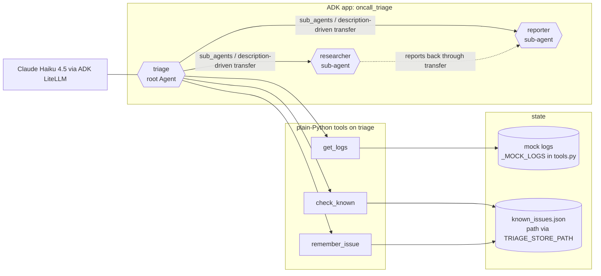
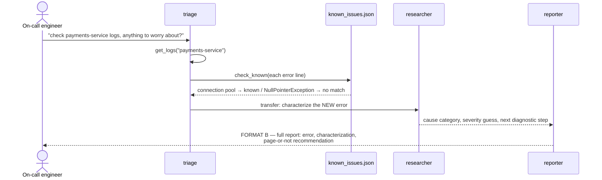
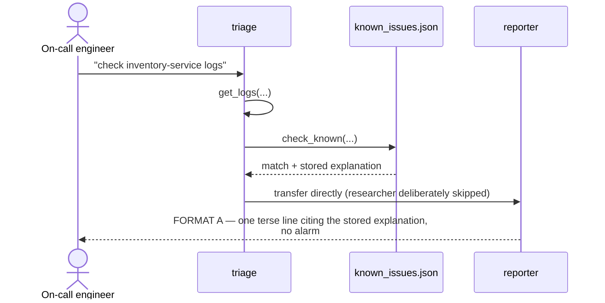
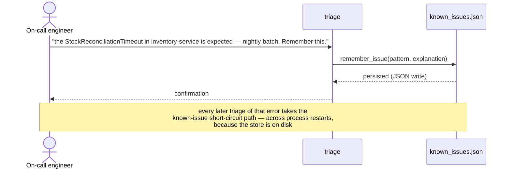

# Architecture — oncall-triage

Engineer-view documentation of the **agent core** (`oncall_triage/`): the
three ADK roles, their tools and the store. The cloud system built around
it in phase 2 (ingest, queue, worker, console, the three bank estates) is
described in [docs/DESIGN.md](docs/DESIGN.md) and the generated C4 views in
[docs/c4/generated/](docs/c4/generated/README.md). For the user-view intro
see README.md; for the phase-1 local demo see DEMO.md.

## Components

Design decisions that matter for review:

- **Dynamic delegation, not `SequentialAgent`** — the flow branches on
  data (known vs new error). A fixed pipeline would run the researcher
  on every request or need a do-nothing instruction. The branch
  condition lives in the triage instruction + `check_known`'s result;
  the routing mechanism is ADK's description-driven `sub_agents`
  transfer.
- **The store is a plain JSON file** behind three tool functions, not
  Memory Bank. Deliberate: keeps every test keyless/offline; Memory
  Bank is the documented production swap-in (the wiring for it was
  proven separately in the adk-learning Day 5 exercise).
- **Model: Claude Haiku 4.5 through ADK's `LiteLlm` wrapper**
  (`anthropic/claude-haiku-4-5-20251001`, the default in
  `oncall_triage/model.py`; `TRIAGE_MODEL` overrides it, and every verdict
  stores the model id and prompt hash for audit). Phase 1 ran on
  `gemini-3.5-flash-lite` and hit the free tier's chronic 503s and model
  retirements; the switch and its reasoning are
  [ADR 0004](docs/adr/0004-claude-via-litellm.md).

## Sequence — new issue (research path)

## Sequence — known issue (short-circuit path)

## Sequence — teach path (what makes it a memory system)

## Test strategy

Two tiers, mirroring the convention the adk-learning sprint established:

- **Wiring tier (13 tests, keyless, free, always run)**: root_agent
  importable; `sub_agents` exactly `[researcher, reporter]`; all three
  tools attached; `get_logs` unknown-service safety; `check_known`
  hit/miss against a temp store; `remember_issue` persist-then-find;
  instruction-content checks (triage names both handoff conditions,
  reporter defines both formats). Rationale: remembering something is
  useless if the instruction doesn't operationalize what to do with it.
- **Live tier (manual, not in CI)**: the full chain was verified live
  2026-09-02 — correct branch taken on first attempt (new error →
  researcher → reporter Format B; taught error → known path). See
  DEMO.md for the reproducible script.

## Provenance

Built end-to-end by dev-loop (`C:\repos\agent-workflow\dev-loop`) from
SPEC.md in one iteration at $0.87 (verifier verdict 10/10, all 10 spec
requirements checked with execution evidence). This repo is itself the
first real artifact produced by that tool.
