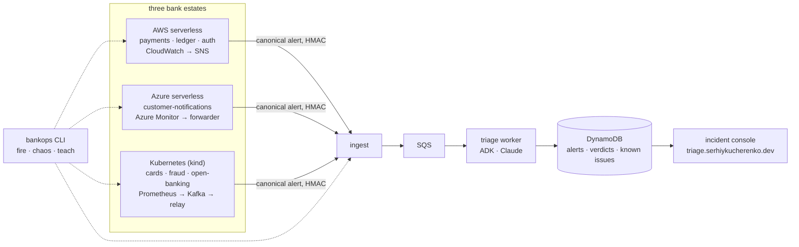

# oncall-triage — Nordwind Bank alert triage

[](https://github.com/KucherenkoSerhiy/oncall-triage/actions/workflows/ci.yml)
[](https://github.com/KucherenkoSerhiy/oncall-triage/actions/workflows/deploy.yml)
[](https://github.com/KucherenkoSerhiy/oncall-triage/actions/workflows/estate-demo.yml)
[](LICENSE)

An LLM-powered alert-triage service for a fictional bank, built the way a
bank would have to build it: three-role agent workflow on Google ADK
(Claude Haiku 4.5 underneath), one triage brain on AWS, three monitored
estates feeding it — serverless on AWS, serverless on Azure, and a
Kubernetes estate with Prometheus, Alertmanager and Kafka — all of it
Terraform and Helm, deployed only by GitHub Actions over OIDC, with C4
diagrams that CI keeps honest. Cloud budget: under $10 a month.

> **Status:** live at [triage.serhiykucherenko.dev](https://triage.serhiykucherenko.dev)
> — M0-M9 shipped, three estates feeding one triage brain, hardened with
> self-observability, DLQ replay, DNSSEC and a recorded rollback drill. See
> the [5-minute demo](#5-minute-demo) and the roadmap below.

## What it does

An alert arrives — from a CloudWatch alarm, an Azure Monitor rule, a
Prometheus rule travelling over Kafka, or the `bankops` chaos client. It is
normalised to one canonical shape, scrubbed of card numbers and IBANs,
de-duplicated, and queued. A triage agent pulls the alert's context and
checks a persistent **known-issues memory**:

- **known** → the reporter answers in one terse line, no page;
- **new** → a tool-less researcher characterises it (cause category,
  severity, next diagnostic step) and the reporter writes the full report
  with a page/monitor recommendation.

Engineers **teach** the system from the incident console ("this error in
payments is expected because…") and the next occurrence short-circuits.
The routing is genuine ADK dynamic delegation — the model chooses the
hand-off from what the store returned, not a fixed pipeline.

## Architecture in one picture

The C4 model lives in [`docs/c4/workspace.dsl`](docs/c4/workspace.dsl) and
is exported to [`docs/c4/generated/`](docs/c4/generated/) by CI (context,
containers, one view per bank estate, worker components, deployment); a
drift check (`scripts/c4_drift.py`) keeps it honest against Terraform tags
and Helm labels — see [`docs/c4/README.md`](docs/c4/README.md). The full
design — decisions, cost model, security posture, pipelines, milestones —
is [`docs/DESIGN.md`](docs/DESIGN.md); each decision has an ADR in
[`docs/adr/`](docs/adr/).



## Try the agent locally (phase 1)

```bash
pip install -r requirements.txt
cp .env.example oncall_triage/.env       # add your model API key
adk web                                  # then: "check payments-service logs"
```

Details, prompts, the three sequence diagrams and a recorded demo
transcript: [`docs/agent.md`](docs/agent.md), [`ARCHITECTURE.md`](ARCHITECTURE.md),
[`DEMO.md`](DEMO.md).

## 5-minute demo

Three unattended probes, each already recorded for real at least once - the
run linked is that recording, not a promise:

1. **AWS, from the console.** Open the console, then
   `bankops chaos payments --mode pool --minutes 5`: a real CloudWatch
   alarm (`PoolExhausted`) reaches the spine and comes back a known-issue
   verdict in **~3-4 minutes**, unattended
   ([run 34414316312](https://github.com/KucherenkoSerhiy/oncall-triage/actions/runs/34414316312), [#18](https://github.com/KucherenkoSerhiy/oncall-triage/issues/18)).
2. **Kubernetes, the Kafka story.** `gh workflow run estate-demo.yml`
   (or the Sunday 06:00 UTC schedule): three chaos scenarios in one
   ~16-minute job - `CardsAuthHighLatency` and `KafkaConsumerLag` verdicts
   travel **over Kafka** (route A), then `KafkaBrokerDown` travels route B
   instead - **one verdict arrived over Kafka; the one about Kafka did not**
   ([run 34437560310](https://github.com/KucherenkoSerhiy/oncall-triage/actions/runs/34437560310), [#24](https://github.com/KucherenkoSerhiy/oncall-triage/issues/24)).
3. **Azure, the slow path.** `gh workflow run deploy.yml -f root=azure -f
   chaos_probe=notifications-429`: Azure Monitor's slower evaluation
   cadence (metric alerts at ~1 min, scheduled query rules at up to 5 min)
   means **~7 minutes** to a `page` verdict, budgeted to 12
   ([run 34427522005](https://github.com/KucherenkoSerhiy/oncall-triage/actions/runs/34427522005), [#20](https://github.com/KucherenkoSerhiy/oncall-triage/issues/20)).

## Roadmap

| M | Milestone | Status | Live probe |
|---|---|---|---|
| M0 | Repo, CI, design, ADRs, C4 model | ✅ | — (no live system yet) |
| M1 | Pipelines + bootstrap: Terraform roots, OIDC to both clouds, budgets, plan-on-PR / approve / apply | ✅ | a PR shows a plan comment; merging applies after approval (first apply 2026-09-09) |
| M2 | Alert spine without LLM: ingest → DynamoDB → SQS, console + API, `bankops fire`, custom domain | ✅ live at [triage.serhiykucherenko.dev](https://triage.serhiykucherenko.dev) | `bankops fire --service payments` shows on the console in < 5s (2026-09-09) |
| M3 | Triage worker on Lambda (ADK + Claude), known-issue store on DynamoDB, teach from console, rollback by SHA | ✅ live | fire known → FORMAT A; fire new → FORMAT B; teach → re-fire → FORMAT A; roll back to previous SHA and re-fire (2026-09-09) |
| M4 | AWS estate: three services + CloudWatch alarms + chaos | ✅ live | `bankops chaos payments --mode pool` → verdict `known, ack` in ~4 min, unattended ([run 34414316312](https://github.com/KucherenkoSerhiy/oncall-triage/actions/runs/34414316312), [#18](https://github.com/KucherenkoSerhiy/oncall-triage/issues/18)) |
| M5 | Azure estate: Functions + Azure Monitor + alert forwarder + chaos | ✅ live (swedencentral) | `bankops chaos customer-notifications --mode provider-429` → forwarder → verdict `page` in ~7 min ([run 34427522005](https://github.com/KucherenkoSerhiy/oncall-triage/actions/runs/34427522005), [#20](https://github.com/KucherenkoSerhiy/oncall-triage/issues/20)) |
| M6 | Kubernetes estate on kind: Helm chart, Prometheus/Alertmanager, route B, `estate-demo.yml` | ✅ live | `estate-demo.yml`: cards-authorization faulted, verdict `page` via route B in a 20-min job ([run 34427929878](https://github.com/KucherenkoSerhiy/oncall-triage/actions/runs/34427929878), [#22](https://github.com/KucherenkoSerhiy/oncall-triage/issues/22)) |
| M7 | Kafka backbone: Strimzi, topics, alerts-bridge + kafka-relay (route A), consumer-lag alerts | ✅ live | three-scenario `estate-demo.yml` run - Kafka-routed and route-B verdicts side by side - in one 16-min job ([run 34437560310](https://github.com/KucherenkoSerhiy/oncall-triage/actions/runs/34437560310), [#24](https://github.com/KucherenkoSerhiy/oncall-triage/issues/24)) |
| M8 | C4 drift check against Terraform tags and Helm labels | ✅ | `scripts/c4_drift.py` green in `ci.yml`'s `c4` job on every PR ([#25](https://github.com/KucherenkoSerhiy/oncall-triage/issues/25)) |
| M9 | Hardening: self-observability + SLO, DLQ replay, known-issues export, DNSSEC, OIDC subjects, runbooks, rollback drill | ✅ M9a-e merged | dashboard + 5 `ops` alarms + `docs/slo.md` ([#26](https://github.com/KucherenkoSerhiy/oncall-triage/issues/26)); weekly export + `bankops replay-dlq` ([#27](https://github.com/KucherenkoSerhiy/oncall-triage/issues/27)); DNS query logging live, DNSSEC signing gated behind `enable_dnssec` until bootstrap grants KMS rights ([#28](https://github.com/KucherenkoSerhiy/oncall-triage/issues/28), [#81](https://github.com/KucherenkoSerhiy/oncall-triage/issues/81)); environment-scoped OIDC subjects for PR plans ([#29](https://github.com/KucherenkoSerhiy/oncall-triage/issues/29)); runbooks + a real, recorded rollback drill ([#30](https://github.com/KucherenkoSerhiy/oncall-triage/issues/30), [run 34437783068](https://github.com/KucherenkoSerhiy/oncall-triage/actions/runs/34437783068)) |

Every milestone has an offline gate CI runs and a live probe recorded in
its pull request — the definition of done is in the
[PR template](.github/PULL_REQUEST_TEMPLATE.md). Work is tracked as
[GitHub milestones](https://github.com/KucherenkoSerhiy/oncall-triage/milestones)
with one issue per pull-request-sized slice (`M5a`, `M5b`, ...); the
specs the slices are built from live in [`docs/specs/`](docs/specs/).

`estate-demo.yml`'s unattended run is the sharpest proof of the whole
Kubernetes estate: it sets `lag` on fraud-scoring, waits for
`KafkaConsumerLag` to fire, and confirms the verdict travelled route A —
over Kafka, through `alerts-bridge` and `kafka-relay` — before scaling the
Kafka broker to zero and confirming the verdict for *that* failure travelled
route B instead. One verdict arrived over Kafka; the one about Kafka did
not (see [ADR 0015](docs/adr/0015-route-a-relay-instead-of-a-public-kafka-endpoint.md)
and `docs/runbooks/kubernetes-estate.md`).

## What a reviewer should look at

- **Tests**: `task test` (ruff, mypy, pytest) — moto-backed unit tests for
  every Lambda; no live AWS/Azure call in the suite. `pytest tests/contract
  -m contract` (`ci.yml`'s `contract` job) runs the Kafka producer/consumer
  contract tests against a real `testcontainers` Redpanda broker.
- **Terraform gates**: `task tf:validate`, `task tf:lint`, `task tf:scan` —
  fmt, validate, tflint and checkov on every root; every policy exception
  lives in [`.checkov.yaml`](.checkov.yaml) with a reason.
- **Design docs**: [`docs/DESIGN.md`](docs/DESIGN.md) (decisions, cost
  model, security posture), one [ADR](docs/adr/) per decision, and
  [`docs/slo.md`](docs/slo.md) — the one SLO this system holds itself to.
- **Self-observability**: the CloudWatch dashboard and the five `ops`
  alarms (`infra/aws/observability.tf`) are the fastest way to see whether
  the live spine is healthy before reaching for `diagnose.yml`.
- **C4 drift**: `task c4-drift` (`scripts/c4_drift.py`) checks that every
  container in `docs/c4/workspace.dsl` still matches a `c4_container`
  Terraform tag or a `nordwind.dev/c4-container` Helm label — see
  [`docs/c4/README.md`](docs/c4/README.md) and
  [ADR 0016](docs/adr/0016-c4-drift-as-a-merge-gate.md).
- **Runbooks**: [`docs/runbooks/`](docs/runbooks/) — `triage-spine.md`
  (symptom-first: what you'd see, the exact `diagnose.yml` invocation,
  likely causes each citing the incident it came from, fix, verify),
  `deploy-and-rollback.md` (the pipeline plus a real, recorded rollback
  drill), `secrets-rotation.md` (five secrets, one section each, a real
  console-token rotation), `cost.md`, and `kubernetes-estate.md`. Every
  runbook section cites the issue that motivated it — see
  [ADR 0017](docs/adr/0017-runbooks-derived-from-incidents.md).
- **Issues-per-slice tracking**: [GitHub milestones](https://github.com/KucherenkoSerhiy/oncall-triage/milestones)
  and one issue per pull-request-sized slice, linked from the roadmap table
  above and every runbook citation.
- **Cost**: [`docs/runbooks/cost.md`](docs/runbooks/cost.md) — the
  dollar-by-dollar table with what's actually live today, the two budgets,
  what to destroy first if one fires.
- **Architecture pictures**: [`docs/c4/generated/README.md`](docs/c4/generated/README.md) —
  system context, containers, one view per bank estate, worker components,
  both dynamic routes, and deployment (`demo` and `kind`), all generated
  from [`docs/c4/workspace.dsl`](docs/c4/workspace.dsl) and kept honest by
  the drift check above.

## Cost

| Line | $/month, live today |
|---|---|
| Cloud (AWS + Azure), everything above | ≈ 0.80-1.00 |
| KMS DNSSEC key, once `enable_dnssec=true` | +≈ 1.00 |
| Anthropic API (outside the two cloud budgets) | ≈ 2.50 |
| **Two budget guardrails** | AWS $8/month, Azure $2/month, one e-mail |

Full line-by-line breakdown, what's actually deployed vs. still gated, and
what to destroy first if a budget alarm fires:
[`docs/runbooks/cost.md`](docs/runbooks/cost.md).

## Repository map

```
oncall_triage/     the ADK agents and tools (phase 1, live-verified)
tests/             wiring + store tests (no API key needed)
infra/             Terraform: bootstrap (once, by hand) and the CI-applied roots — see infra/README.md
docs/              DESIGN.md · adr/ · c4/ (Structurizr DSL + generated Mermaid) · runbooks/ · agent.md
.github/           ci.yml · deploy.yml · diagnose.yml · c4.yml · PR template · dependabot
Taskfile.yml       task test | lint | tf:validate | tf:lint | tf:scan | c4 | c4-drift | docs-check | agent
```

## Working on it

```bash
task install      # dev dependencies + pre-commit hooks
task test         # ruff, mypy, pytest — what ci.yml runs
task tf:validate  # fmt, init (no backend), validate every Terraform root
task c4           # regenerate diagrams from the model (Docker)
task c4-drift     # check the model against Terraform tags and Helm labels
task docs-check   # fail on a broken relative link or an orphaned C4 view
```

Conventions: trunk-based, pull requests only, squash-merge, conventional
commits; a plan comment on every infrastructure PR; no cloud credential
ever stored in GitHub. License: [MIT](LICENSE).
