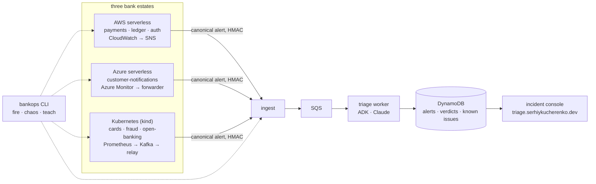

# oncall-triage — Nordwind Bank alert triage

[](https://github.com/KucherenkoSerhiy/oncall-triage/actions/workflows/ci.yml)
[](https://github.com/KucherenkoSerhiy/oncall-triage/actions/workflows/deploy.yml)
[](LICENSE)

An LLM-powered alert-triage service for a fictional bank, built the way a
bank would have to build it: three-role agent workflow on Google ADK
(Claude Haiku 4.5 underneath), one triage brain on AWS, three monitored
estates feeding it — serverless on AWS, serverless on Azure, and a
Kubernetes estate with Prometheus, Alertmanager and Kafka — all of it
Terraform and Helm, deployed only by GitHub Actions over OIDC, with C4
diagrams that CI keeps honest. Cloud budget: under $10 a month.

> **Status:** phase 1 (the agent) is done and live-verified; phase 2 (the
> cloud system) is being built milestone by milestone — see the roadmap.

## What it does

An alert arrives — from a CloudWatch alarm, an Azure Monitor rule, a
Prometheus rule travelling over Kafka, or the `bankops` chaos client. It is
normalised to one canonical shape, scrubbed of card numbers and IBANs,
de-duplicated, and queued. A triage agent pulls the alert's context and
checks a persistent **known-issues memory**:

- **known** → the reporter answers in one terse line, no page;
- **new** → a tool-less researcher characterises it (cause category,
  severity, next diagnostic step) and the reporter writes the full report
  with a page/monitor recommendation.

Engineers **teach** the system from the incident console ("this error in
payments is expected because…") and the next occurrence short-circuits.
The routing is genuine ADK dynamic delegation — the model chooses the
hand-off from what the store returned, not a fixed pipeline.

## Architecture in one picture

The C4 model lives in [`docs/c4/workspace.dsl`](docs/c4/workspace.dsl) and
is exported to [`docs/c4/generated/`](docs/c4/generated/) by CI (context,
containers, the Kubernetes estate, worker components, deployment). The
full design — decisions, cost model, security posture, pipelines,
milestones — is [`docs/DESIGN.md`](docs/DESIGN.md); each decision has an
ADR in [`docs/adr/`](docs/adr/).



## Try the agent locally (phase 1)

```bash
pip install -r requirements.txt
cp .env.example oncall_triage/.env       # add your model API key
adk web                                  # then: "check payments-service logs"
```

Details, prompts, the three sequence diagrams and a recorded demo
transcript: [`docs/agent.md`](docs/agent.md), [`ARCHITECTURE.md`](ARCHITECTURE.md),
[`DEMO.md`](DEMO.md).

## Roadmap

| M | Milestone | Status |
|---|---|---|
| M0 | Repo, CI, design, ADRs, C4 model | ✅ |
| M1 | Pipelines + bootstrap: Terraform roots, OIDC to both clouds, budgets, plan-on-PR / approve / apply | ✅ code · ⏳ first apply |
| M2 | Alert spine without LLM: ingest → DynamoDB → SQS, console + API, `bankops fire`, custom domain | ⏳ |
| M3 | Triage worker on Lambda (ADK + Claude), known-issue store on DynamoDB, teach from console, rollback by SHA | ⏳ |
| M4 | AWS estate: three services + CloudWatch alarms + chaos | ⏳ |
| M5 | Azure estate: Functions + Azure Monitor + alert forwarder + chaos | ⏳ |
| M6 | Kubernetes estate on kind: Helm chart, Prometheus/Alertmanager, route B, `estate-demo.yml` | ⏳ |
| M7 | Kafka backbone: Strimzi, topics, alerts-bridge + kafka-relay (route A), consumer-lag alerts | ⏳ |
| M8 | C4 drift check against Terraform tags and Helm labels | ⏳ |
| M9 | Hardening: self-observability + SLO, runbooks, rollback drill | ⏳ |

Every milestone has an offline gate CI runs and a live probe recorded in
its pull request — the definition of done is in the
[PR template](.github/PULL_REQUEST_TEMPLATE.md).

## Repository map

```
oncall_triage/     the ADK agents and tools (phase 1, live-verified)
tests/             wiring + store tests (no API key needed)
infra/             Terraform: bootstrap (once, by hand) and the CI-applied roots — see infra/README.md
docs/              DESIGN.md · adr/ · c4/ (Structurizr DSL + generated Mermaid) · agent.md
.github/           ci.yml · deploy.yml · c4.yml · PR template · dependabot
Taskfile.yml       task test | lint | tf:validate | tf:lint | tf:scan | c4 | agent
```

## Working on it

```bash
task install      # dev dependencies + pre-commit hooks
task test         # ruff, mypy, pytest — what ci.yml runs
task tf:validate  # fmt, init (no backend), validate every Terraform root
task c4           # regenerate diagrams from the model (Docker)
```

Conventions: trunk-based, pull requests only, squash-merge, conventional
commits; a plan comment on every infrastructure PR; no cloud credential
ever stored in GitHub. License: [MIT](LICENSE).
