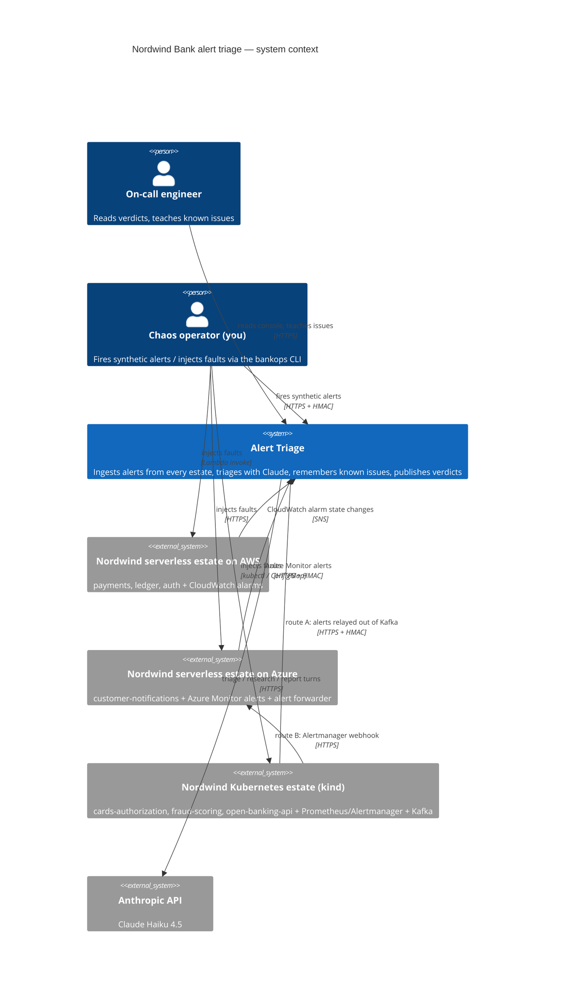
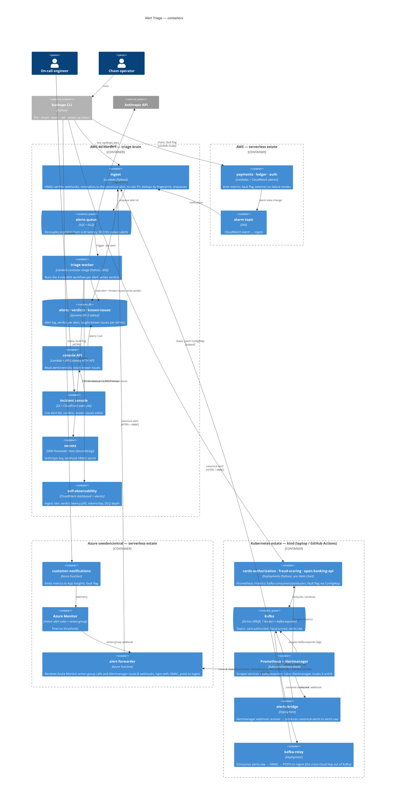
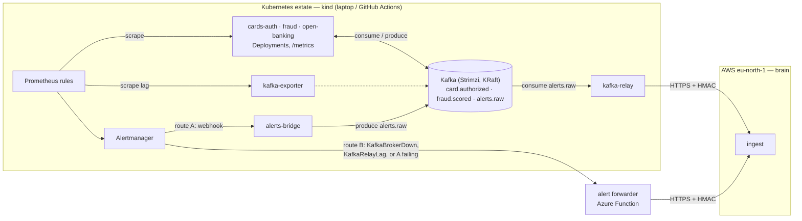
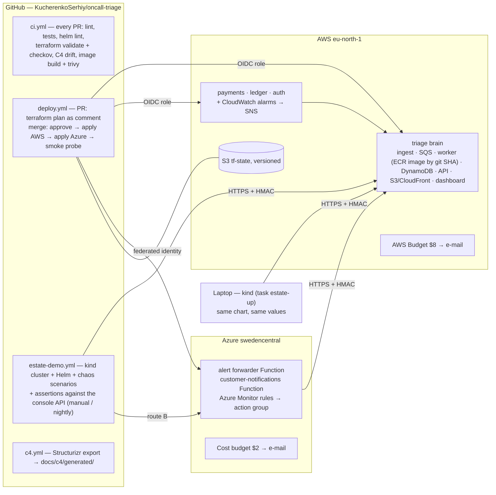
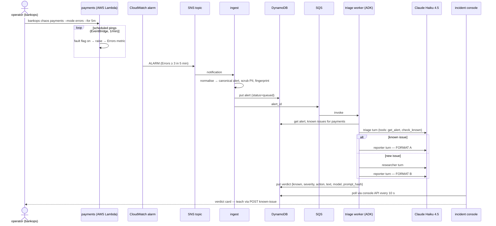

# Nordwind Bank — cloud alert triage: design

Status: **approved, v2.1** (2026-09-07) — building. All decisions are
taken (§2); nothing is open (§12).

## 0. The 20% — if you read nothing else

1. **One brain, three estates.** The triage agent (the existing three
   ADK roles, now on Claude) runs serverless on AWS. It receives alerts
   from three places that imitate a real bank: an AWS serverless estate
   (Lambda + CloudWatch), a small Azure serverless estate (Functions +
   Azure Monitor), and a **Kubernetes estate** (Prometheus + Alertmanager
   + Kafka) that runs in **kind** — on your laptop for daily work, inside
   GitHub Actions for the automated demo. Kubernetes costs $0.
2. **Every alert becomes the same JSON first.** Whatever the source,
   `ingest` turns it into one *canonical alert*, scrubs card numbers and
   IBANs, dedups it, and queues it. Everything downstream only ever sees
   that shape.
3. **Two routes out of the Kubernetes estate.** Alerts travel *over
   Kafka* (route A) — except the alert that says Kafka is down, which
   must take the HTTPS route (route B). The `broker-down` chaos mode is
   the demo of why you need both.
4. **Nothing in the cloud runs 24 × 7 except serverless**, so the bill is
   ≈ $1–2/month. The only hourly meter in cloud pricing is "a VM
   exists", and this design has none.
5. **GitHub Actions is the only thing that deploys.** A pull request
   produces a Terraform *plan* you read; merging applies it after you
   click approve. Actions authenticates to both clouds with OIDC — there
   are no cloud keys stored anywhere.
6. **Diagrams are code.** The C4 model lives in `docs/c4/workspace.dsl`;
   CI fails when it disagrees with what Terraform and Helm actually
   deployed.
7. **dev-loop writes the code; you approve plans and supply
   credentials.** That is the whole human role until something breaks.
8. Nine milestones (§13). Each ends with a test you can run and a thing
   you can see on the console.

Glossary, one line each: **OIDC** — GitHub proves its identity to a
cloud with a signed token instead of a stored password. **HMAC** — a
signature over a webhook body using a shared secret, so ingest knows the
alert is genuine. **kind** — a full Kubernetes cluster running as Docker
containers. **Helm** — the package manager for Kubernetes apps (a
"chart" = a templated bundle of manifests). **Strimzi** — an operator
that runs Kafka inside Kubernetes. **Alertmanager** — the component that
takes Prometheus alerts and routes them (webhook, e-mail, …). **Canonical
alert** — our one JSON shape for every alert (§7). **Drift check** — a CI
test that the diagram and the infrastructure list the same things.

## 1. What we are building, in one paragraph

Today `oncall-triage` is a three-role ADK agent that reads mock logs from
a Python dict. We turn it into the alert-triage service of a fictional
bank, *Nordwind Bank*, whose workloads span the three paradigms real
banks actually mix: a **serverless estate on AWS**, a **serverless estate
on Azure**, and a **Kubernetes estate** monitored by Prometheus and
Alertmanager with a **Kafka event backbone** (Strimzi, in-cluster).
Cloud-native alarms, Prometheus alerts arriving over Kafka, and a
synthetic alert-firing client all flow into one triage brain hosted on
AWS. The brain recognises known issues from a persistent memory,
researches new ones with Claude, and publishes verdicts to an incident
console. Every piece of infrastructure is Terraform (+ Helm for the
Kubernetes estate); every diagram is C4-as-code that CI checks against
the deployed resources. Cloud spend target **≤ $10 / month**, modelled at
≈ $1–2, with budget alarms at $8 (AWS) and $2 (Azure).

## 2. Decisions taken ✅

| # | Decision | Choice | Why |
|---|---|---|---|
| D1 | Cloud topology | **Split roles**: triage brain + memory on AWS; bank estates feed it from AWS, Azure, and Kubernetes | Realistic multi-cloud bank (SRE tooling in one cloud, workloads everywhere); one LLM path to secure and pay for |
| D2 | IaC | **Terraform** for cloud resources, **Helm** for in-cluster software | One language per layer, both industry defaults |
| D3 | Delivery surface | **Incident console** static web page | Demo surface with zero moving parts; Slack / Teams / e-mail are v2 adapters |
| D4 | Model | **Claude Haiku 4.5 via ADK's LiteLLM adapter** | Quality over free-tier 503 roulette; ≈ $2–3/month at demo volume, billed outside the $10 |
| D5 | Regions | AWS **`eu-north-1` (Stockholm)**, Azure `swedencentral` (Stockholm; westeurope refuses new subscriptions and northeurope has no Consumption quota - ADR 0005) | EU bank narrative (data residency); both carry every service we use. Stockholm rather than Frankfurt because the AWS account (new sign-up experience) ships with an AWS-managed *region floor* SCP that allows eu-north-1 + global services — we keep that guardrail instead of editing it (ADR 0005, 0014) |
| D6 | Kubernetes + Kafka | **Included** — a Prometheus/Alertmanager-monitored estate with Strimzi Kafka as event backbone and alert transport | "Used everywhere"; a triage system that never saw an Alertmanager webhook or a consumer-lag alert isn't credible in a bank |
| D7 | Where Kubernetes runs | **kind**: laptop for development, **GitHub Actions** for the repeatable demo; AKS kept as a documented v2 option (same charts) | Kubernetes is free; the VM under a cloud cluster is what costs money. Trade: AWS cannot reach the in-cluster Kafka, so the cross-cloud hop out of Kafka is a relay pod (route A) — see §4.4 |
| D8 | Delivery | Trunk-based, PR-only, **plan on PR → approve → apply on merge**, OIDC to both clouds, images by git SHA | The pipeline is part of the product: it's how a bank would run this, and it's the part most job descriptions actually test |
| D9 | Domain | **`triage.serhiykucherenko.dev`** (console) and **`api.triage.serhiykucherenko.dev`** (console API + webhooks): a Route 53 hosted zone for the `triage` subdomain, delegated once by NS records at the parent's DNS; ACM certificates via DNS validation | Portfolio project — a real hostname with a real certificate is part of the showcase; +$0.50/month |
| D10 | Console auth | Bearer token entered once in the browser (v1); Cognito / Entra ID SSO is v2 | 20 lines, no new service, clear upgrade path |
| D11 | Diagrams | **Structurizr DSL** is the source of truth from M1, exported by CI; the drift check lands in M8 | "IaC fashion" for diagrams — and diagrams exist before the first resource, not after the last |
| D12 | Repo | Nightly `estate-demo.yml` on by default; repo goes **public at M2** | It's the regression suite and it's the portfolio |
| D13 | Quality bar | This is a **showcase first**: every milestone ships with tests, docs, and updated diagrams, or it doesn't ship | A reviewer skimming the repo must find no "no tests" / "stale docs" red flag |

## 3. The bank (simulated)

Seven services across three estates, each with a failure repertoire the
chaos client can trigger. They are tiny programs that mostly sleep and
emit metrics — the point is the *alerts*, not the business logic. Kafka
carries the business events inside the Kubernetes estate. Known-issue
memory ships pre-seeded per service so the known-vs-new split is
demonstrable on day one, exactly as the repo does today.

| Service | Estate | Pretends to | Failure modes (chaos) | Native alarm | Deployed |
|---|---|---|---|---|---|
| `payments` | AWS Lambda | card payment authorisation API | `errors` (5xx burst), `latency` (p99 > 2 s), `pool` (connection pool exhausted — the seeded known issue) | CloudWatch on Lambda `Errors`, `Duration` p99 | M4 ✅ |
| `ledger` | AWS Lambda ← SQS | double-entry posting worker | `reconciliation-mismatch`, `lag` (queue age) | CloudWatch on SQS `ApproximateAgeOfOldestMessage` | M4 ✅ |
| `auth` | AWS Lambda | token issuance / JWKS | `jwks-rotation` (unknown key id), `lockouts` | CloudWatch on custom metric `AuthFailures` | M4 ✅ |
| `customer-notifications` | Azure Function | SMS / e-mail fan-out | `provider-429`, `backlog` | Azure Monitor metric alert on Function failures + storage-queue length | M5 ✅ |
| `cards-authorization` | Kubernetes (kind) | ISO-8583-ish auth switch; **produces** `card.authorized` | `timeouts`, `issuer-down` | Prometheus rule on request p99 / error ratio | M6 (kind) |
| `fraud-scoring` | Kubernetes (kind) | ML scoring; **consumes** `card.authorized`, **produces** `fraud.scored` | `model-drift`, `latency`, `crashloop`, `lag` (stops consuming, live M7a) | Prometheus rules on `fraud_score_bucket` drift, pod restarts, `kafka_consumergroup_lag` | M6 (kind); Kafka wiring + `lag` M7a |
| `open-banking-api` | Kubernetes (kind) | PSD2 third-party API gateway; **consumes** `fraud.scored` | `rate-limit-storm` (429s), `cert-expiry` | Prometheus rules on 429 ratio, `probe_ssl_earliest_cert_expiry` | M6 (kind); Kafka wiring M7a |
| *(platform)* | Kubernetes (kind) | Kafka broker (Strimzi, KRaft, 1 node), Prometheus, Alertmanager, relay | `broker-down` (scale Kafka to 0, live M7a) | Alertmanager `KafkaBrokerDown`, `KafkaRelayLag` | Strimzi cluster + topics/users/ACLs M7a; alerts-bridge/kafka-relay + alert rules M7b |

## 4. Architecture

### 4.1 C4 — system context



### 4.2 C4 — containers



### 4.3 The triage worker — components

The existing three roles survive intact; only the tools change.

| Component | Today | Cloud version |
|---|---|---|
| `triage` root agent | `get_logs(service)` from a dict | `get_alert(alert_id)` → canonical alert incl. sample log lines; `get_recent_alerts(service, 30m)` for blast-radius context |
| `check_known` | substring match in `known_issues.json` | Same matching (v1) over DynamoDB keyed by service. The `TRIAGE_STORE_PATH` seam becomes a `KnownIssueStore` interface: `JsonFileStore` (tests, local) and `DynamoStore` (cloud) |
| `researcher` | reasoning only | unchanged — deliberately tool-less |
| `reporter` | two formats | two formats + a machine-readable verdict block `{severity, action: page|monitor|ack, known}` the console renders as chips |
| `remember_issue` | append to JSON | put to DynamoDB; also callable from the console (teach) |
| model | `gemini-3.5-flash-lite` | `LiteLlm(model="anthropic/claude-haiku-4-5-20251001")`; model id + prompt hash stored on every verdict for audit |
| runtime | `adk web` | ADK `Runner` + `InMemorySessionService` per invocation inside an **image-based** Lambda (arm64) triggered by SQS — one alert = one session, nothing long-lived. The image is built and pushed by `deploy.yml`'s `image` job, tagged by git SHA |

### 4.4 The Kubernetes estate — kind, Kafka, and the two routes

**Why kind, not a cloud cluster.** Kubernetes is free everywhere; what
costs money is the VM under a managed cluster (≈ $36–72/month for one
small node, or ≈ $3/month if brought up per session with a "forgot to
destroy it" risk). `kind` runs a complete cluster as Docker containers.
The same Helm chart and values run in three places:

| Where | Purpose | Lifetime | Cost |
|---|---|---|---|
| **Laptop** (`task estate-up`) | daily development, kubectl fluency, poking at Prometheus/Kafka UIs | while you work | $0 (needs ~6 GB RAM for Docker Desktop) |
| **GitHub Actions** (`estate-demo.yml`) | the canonical, repeatable demo: create cluster → Helm install → run chaos scenarios → assert verdicts appear on the AWS console API → upload Alertmanager/Kafka logs as artifacts → destroy | one run, ≈ 15 min | $0 (≈ 150 of 2,000 free minutes/month) |
| AKS (`infra/azure-aks`, **v2, optional**) | a real cloud cluster when you want AWS to consume Kafka directly | per session | ≈ $3/month |

**Kafka is both the business event backbone** (`card.authorized` →
`fraud-scoring` → `fraud.scored` → `open-banking-api`) **and an alert
transport** (`alerts.raw`). Two routes out of the estate, and the choice
between them is the demo:

- **Route A — over Kafka**: Prometheus rule → Alertmanager →
  `alerts-bridge` (webhook receiver that produces canonical alerts to
  `alerts.raw`) → `kafka-relay` (consumer that HMAC-signs and POSTs to
  `ingest`). Inside the estate the alert is a Kafka message; the
  cross-cloud hop is outbound HTTPS, which works from a laptop, a CI
  runner, or a cluster with no public endpoint.
- **Route B — over HTTPS**: Alertmanager → `alert forwarder` (Azure
  Function) → HMAC → `ingest`. For the four alerts *about* Kafka itself —
  `KafkaBrokerDown`, `KafkaRelayLag`, `AlertsBridgeDown`, `KafkaRelayDown` —
  which cannot reliably travel over the thing they're reporting broken.
  Alertmanager's routing is a static match on alert name, not a
  deliver-then-fall-back; everything else defaults to route A. The
  `broker-down` chaos mode makes it visible: the
  alert about Kafka arrives, and it did not come via Kafka.



### 4.5 Deployment view



## 5. The alert path, end to end



The synthetic path (`bankops fire --service fraud-scoring --alert model-drift`)
skips the first four lines and posts a canonical alert to `ingest`
directly — same HMAC, same downstream. The Kubernetes paths replace
CloudWatch/SNS with Prometheus → Alertmanager → relay (A) or forwarder
(B); the Azure path with Azure Monitor → action group → forwarder.

## 6. Engineering practice — pipelines, environments, quality gates

This section is the "how a bank would run it" part, and the part worth
learning most carefully. Four workflows, one environment, no keys.

### 6.1 The four workflows

| Workflow | Trigger | What it does | Time |
|---|---|---|---|
| `ci.yml` | every push / PR | `ruff` + `mypy` · `pytest` (unit + contract tests with `moto` for AWS and `testcontainers` Redpanda for Kafka) · `helm lint` + `kubeconform` · `terraform fmt -check` + `validate` + `tflint` + `checkov` · **C4 drift check** · build the worker image (no push) + `trivy` scan (fail on CRITICAL) | < 8 min |
| `deploy.yml` | PR → `plan`; merge to `main` → `apply` | PR: `terraform plan` for `infra/aws` and `infra/azure`, posted as a PR comment so you read the diff. Merge: waits for the **`demo` environment approval** (you click), applies AWS then Azure, pushes the worker image tagged with the git SHA, runs the smoke probe (`bankops fire` → poll console API ≤ 90 s). Failure opens an issue with the log | 6–10 min |
| `estate-demo.yml` | manual (`workflow_dispatch`) + nightly | kind cluster → Helm install (Strimzi, kube-prometheus-stack, `nordwind-bank` chart) → run the chaos scenarios from `platform/scenarios/*.yaml` → assert each expected verdict appears on the console API → upload Alertmanager + Kafka logs as artifacts → destroy | ≈ 15 min |
| `c4.yml` | change under `docs/c4/` | `structurizr/cli` export to Mermaid + PNG, committed to `docs/c4/generated/` so PRs show diagram diffs | 2 min |

### 6.2 Branching, environments, releases, rollback

- **Trunk-based.** Short-lived branches, PR required, squash-merge,
  `main` is always deployable. Conventional-commit messages feed the
  changelog.
- **One real environment, `demo`** (AWS + Azure), declared as a GitHub
  Environment with a required reviewer (you). Local development uses
  kind + `JsonFileStore` + a local `ingest` stub — no cloud needed to
  work on the agent or the estate. PR preview environments are a
  documented v2 (they'd need a second set of everything).
- **Images are immutable and named by git SHA** (`worker:sha-abc1234`);
  Terraform pins the SHA it deploys. **Rollback** = re-run `deploy.yml`
  with the previous SHA as input; no rebuild. A quarterly *rollback
  drill* is a milestone-9 deliverable, not a hope.
- **Secrets**: Anthropic key and HMAC seed as GitHub Environment secrets
  → written to SSM / Key Vault by Terraform. Cloud auth is OIDC only.
  Dependabot watches `pip`, `terraform`, `github-actions`, `helm`.

### 6.3 Quality gates — definition of done for any PR

Tests green · plan reviewed and understood · C4 drift check green ·
`trivy` no CRITICAL · `checkov` no HIGH · docs/ADR updated when a
decision changed · the milestone's live probe (§13) recorded in the PR.

### 6.4 The triage system watches itself

A CloudWatch dashboard and four alarms, all always-free: alerts ingested
per hour; verdict latency p50/p95 (ingest → verdict); Claude tokens and
$/day; DLQ depth. **SLO: 95% of verdicts within 90 s of ingest.** Alarms
on `DLQ > 0`, worker errors, and the daily LLM cap publish to the same
SNS topic as the bank's alarms — so the triage system triages alerts
about itself, which is both a good demo and how you find out it's broken.

### 6.5 Developer workflow

- `Taskfile.yml`: `task test` · `task estate-up` / `estate-down` (kind +
  Helm) · `task chaos -- payments errors` · `task plan` · `task demo`
  (runs the same scenarios as CI, locally).
- `pre-commit`: `ruff`, `terraform fmt`, `helm lint`, secret scanning
  (`gitleaks`).
- Runbooks in `docs/runbooks/`: worker stuck / DLQ growing · rotate HMAC
  or Anthropic key · cost spike · estate demo failing · restore
  known-issues from the weekly S3 export.
- ADRs in `docs/adr/` for D1–D8; a new ADR whenever a D-row changes.
- Naming `nordwind-<env>-<component>`; tags `project`, `env`,
  `c4_container`, `owner`, `cost_center` on every resource (the bank
  flavour, and what the drift check and the cost report both key on).

## 7. Canonical alert schema

```json
{
  "alert_id": "ulid",
  "fingerprint": "sha256(source, service, alert_name, labels)",
  "source": "cloudwatch | azure-monitor | alertmanager | bankops",
  "estate": "aws | azure | kubernetes",
  "service": "payments",
  "alert_name": "HighErrorRate",
  "severity": "sev1 | sev2 | sev3 | sev4",
  "title": "payments 5xx rate above 5% for 5 min",
  "description": "free text from the source",
  "sample_logs": ["ERROR ... connection pool exhausted ..."],
  "labels": { "env": "demo", "region": "eu-north-1", "runbook": "RB-PAY-004", "route": "A" },
  "fired_at": "RFC3339",
  "received_at": "RFC3339",
  "raw": { "...source payload, PAN/IBAN-scrubbed..." }
}
```

Dedup: an alert whose `fingerprint` is still firing within 30 min
attaches to the open alert (counter++) instead of being re-triaged —
a flapping alarm can't burn the LLM budget.

## 8. Security posture (what "bank" buys us)

- **No long-lived cloud keys anywhere.** GitHub Actions assumes an AWS
  IAM role via OIDC and an Azure app registration via federated
  credential. Your laptop signs in once for bootstrap only.
- **Webhooks are HMAC-signed** (`X-Nordwind-Signature: sha256=…` over
  timestamp + body, 5-min replay window). SNS → ingest is a direct Lambda
  subscription (no public endpoint). The relay and the forwarder hold the
  secret (Kubernetes Secret / Key Vault); ingest reads it from SSM.
- **PII never reaches the model.** Ingest scrubs PAN (Luhn-valid 13–19
  digit runs), IBAN and e-mail patterns from `description`, `sample_logs`
  and `raw` before storage; a test corpus pins the scrubber.
- **Least privilege per function**: ingest can put to two tables + one
  queue; the worker reads/writes its tables and one SSM parameter; the
  console API has no queue access; nothing has `*`. Kafka clients use
  SASL/SCRAM with per-client ACLs even inside kind — same manifests work
  on a real cluster later.
- **Audit trail**: every verdict stores model id, prompt-template hash,
  input alert id and token counts; the console shows who taught what,
  when.
- **Supply chain**: images scanned by `trivy`, IaC by `checkov`, repo by
  `gitleaks`; Dependabot PRs; images pinned by digest in the chart.
- Encryption at rest everywhere by default; TLS enforced at CloudFront;
  API Gateway throttled at 10 rps / 20 burst. Console access v1: a
  bearer token entered once in the browser; v2: Cognito or Entra ID SSO.

## 9. Cost model

Steady state, counted *after* the 12-month free tiers expire — only
always-free allowances are assumed free. The meter column is *why* each
line costs what it does.

| Line | Meter | Our usage | $/month |
|---|---|---|---|
| Lambda (ingest, worker, API, 3 services) | requests + GB-s | ~50k invocations; worker 2 GB × 40 s × 300 alerts ≈ 24k GB-s (6% of always-free) | 0 |
| SQS, SNS, EventBridge | per message | < 100k | 0 |
| DynamoDB | provisioned units + GB | 3 tables at 5/5, < 1 GB (on-demand mode is *not* free — we choose provisioned) | 0 |
| CloudWatch | per alarm, per custom metric, GB logs | ≤ 10 alarms, ≤ 10 custom metrics; the 11th metric is $0.30 forever — the line most likely to creep | 0 |
| API Gateway HTTP API | per million calls | < 100k | ~0.10 |
| S3 + CloudFront | GB stored + egress | console < 1 MB; 1 TB egress always-free | ~0.05 |
| ECR | GB-month stored | one ~700 MB worker image (ADK's dependency tree) | ~0.07 |
| SSM Parameter Store | free standard tier | 2 SecureStrings (Secrets Manager would be $0.40 each) | 0 |
| AWS Budgets | per budget | 1 (first two free) | 0 |
| Azure Functions (forwarder + notifications) | executions + GB-s | < 100k | 0 |
| Azure Storage account | GB + transactions | required companion of a Function app | ~0.20 |
| Application Insights / Log Analytics | **per GB ingested** | < 0.3 GB (5 GB free; $2.30/GB beyond — Azure's classic surprise, so verbose logging stays off) | 0 |
| Azure Monitor alert rules | per rule / time series | 2 metric rules (10 series free) | ~0.10 |
| Route 53 hosted zone + ACM certificates | per zone-month; ACM public certs free | one zone for `triage.serhiykucherenko.dev` | 0.50 |
| GitHub Actions | minutes | ≈ 650 of 2,000 free/month on a private repo (unlimited if public) | 0 |
| Kubernetes (kind) | — | laptop and CI runner | 0 |
| **Cloud total** | | worst case ≈ $4.50 with 15 extra custom metrics | **≈ 1.5–2.5** |
| Anthropic API *(outside the $10)* | per MTok in / out | 300 alerts × 3 turns × (~3k in + ~700 out) at Haiku 4.5 $1 / $5 per MTok | ≈ 2.5 |

Ruled out and why: EKS ($73/month control plane before a node), any
always-on VM (≈ $36–72), MSK (≈ $540 minimum), Event Hubs Kafka endpoint
(Standard tier ≈ $22), Secrets Manager (per-secret fee), Container
Insights (per-GB). Guardrails: AWS Budget at $8 and Azure budget at $2
e-mail you; the worker refuses to call the model past 500 alerts/day.

## 10. Diagrams as code, and keeping them honest

- **Source of truth: `docs/c4/workspace.dsl`** (Structurizr DSL) — one
  model, four views: system context, containers, worker components,
  deployment (AWS, Azure, kind). `c4.yml` exports Mermaid + PNG into
  `docs/c4/generated/`, so GitHub renders them and PRs show diagram diffs.
- **Drift check in CI**: every Terraform resource carries a
  `c4_container` tag and every Helm release a `c4_container` label;
  `scripts/c4_drift.py` compares the set of values from
  `terraform show -json` and `helm list -o json` against container
  identifiers in the DSL and fails on any container that exists in one
  place and not the other. Diagrams that lie fail CI, same as tests.
- The Mermaid blocks in this document are the *design-time* sketch; once
  the DSL exists they are replaced by the generated exports.

## 11. Repository layout (target)

```
oncall-triage/
  oncall_triage/            ADK agents + tools (existing) + stores/{json,dynamo}.py
  services/
    ingest/                 Lambda: webhooks → canonical alert → DynamoDB + SQS
    triage_worker/          Lambda container: SQS → ADK Runner → verdict
    console_api/            Lambda: read alerts/verdicts, teach known issues
  bank/
    aws/{payments,ledger,auth}/          Lambdas with fault flags
    azure/{customer_notifications,alert_forwarder}/   Azure Functions
    k8s/{cards_authorization,fraud_scoring,open_banking_api,alerts_bridge,kafka_relay}/
                            container images, Prometheus /metrics, Kafka clients
  platform/                 the Kubernetes estate as code
    charts/nordwind-bank/   Helm chart: three services + bridge + relay (fault flag = ConfigMap)
    kafka/                  Strimzi CRs: Kafka (KRaft), KafkaTopic × 3, KafkaUser × n
    monitoring/             kube-prometheus-stack values, PrometheusRule files, Alertmanager routes A/B
    kind/                   cluster config; the same values files
    scenarios/              chaos scenarios + expected verdicts (used by task demo and estate-demo.yml)
  console/                  static site (vanilla JS, no build step)
  cli/bankops/              fire · chaos · teach · tail · estate up|down
  infra/
    modules/{lambda_fn,dynamo_table,azure_function,budget,...}
    aws/                    root module (brain + AWS estate + dashboard)
    azure/                  root module (forwarder, notifications, Monitor rules, budget)
    azure-aks/              v2, optional: ephemeral AKS running the same charts
  docs/
    DESIGN.md               this file
    adr/                    0001 … 0008 (one per D-row)
    c4/workspace.dsl, c4/generated/
    runbooks/
  scripts/c4_drift.py
  Taskfile.yml  .pre-commit-config.yaml
  .github/workflows/{ci,deploy,estate-demo,c4}.yml
```

## 12. Open decisions

None open. O1–O5 were resolved on 2026-09-07 into D9–D13 above; O6
(how to afford Kubernetes + Kafka) into D7.

## 13. Milestones (each with an offline gate and a live probe)

| M | Deliverable | Offline gate (CI) | Live probe |
|---|---|---|---|
| M0 | Repo on GitHub ✅, `ci.yml` running pytest, target layout, this design merged | 14 tests green in Actions | — |
| M1 | **Pipelines + bootstrap**: Terraform state bucket, OIDC role (AWS), federated identity (Azure), budgets; `deploy.yml` with plan-comment + `demo` approval; `Taskfile`, `pre-commit`, `checkov`/`tflint`/`trivy` in `ci.yml`; empty root modules that plan clean | full `ci.yml` green on an empty stack | a PR shows a plan comment; merging applies after your approval |
| M2 | Alert spine without LLM: ingest (HMAC, scrubber, dedup) → DynamoDB → SQS → stub worker; console API + static console; `bankops fire` | pytest for scrubber / HMAC / dedup / schema; console renders fixtures | `bankops fire --service payments` shows on the console in < 5 s |
| M3 | Real triage worker: ADK on an image-based Lambda built and pushed by the pipeline (`ecr` → `image` jobs in `deploy.yml`), LiteLLM → Claude, `KnownIssueStore` + DynamoStore, teach from console; image by git SHA; rollback input on `deploy.yml` | wiring tests + store contract tests against `moto` | fire known → FORMAT A; fire new → FORMAT B; teach → re-fire → FORMAT A; roll back to previous SHA and re-fire |
| M4 | AWS estate: payments/ledger/auth Lambdas + CloudWatch alarms + SNS → ingest; `bankops chaos` (AWS) | unit tests for fault modes | chaos payments errors → alarm → verdict within ~3 min |
| M5 | Azure estate: forwarder + customer-notifications Functions, Azure Monitor rules, action group; `bankops chaos` (Azure) | forwarder HMAC tests | chaos notifications provider-429 → Azure alert → forwarder → verdict within ~4 min |
| M6 | Kubernetes estate on kind: `nordwind-bank` chart (3 services), kube-prometheus-stack, PrometheusRules, Alertmanager route B → forwarder; `task estate-up`; chaos via ConfigMap; `estate-demo.yml` v1 | `helm lint` + `kubeconform`; chart installs on kind in CI; scenario assertions | `task estate-up` < 5 min; chaos cards-authorization timeouts → Prometheus → Alertmanager → forwarder → verdict |
| M7 | Kafka backbone: Strimzi (KRaft) + topics + SCRAM users; producers/consumers across the three services; `alerts-bridge` + `kafka-relay` (route A); kafka-exporter + lag rules; scenarios for both routes | contract tests against `testcontainers` Redpanda; bridge + relay unit tests | chaos fraud-scoring lag → `KafkaConsumerLag` travels **over Kafka** → verdict; chaos broker-down → `KafkaBrokerDown` arrives via route B; `estate-demo.yml` green end to end |
| M8 | C4 pipeline: `workspace.dsl` (incl. kind deployment view), `c4.yml`, `c4_drift.py` over Terraform tags **and** Helm labels; ADRs 0001–0008 | drift check green; a deliberately untagged resource fails it | — |
| M9 | Hardening + operations: self-observability dashboard + 4 alarms + SLO, DLQ alarm, daily LLM cap, weekly known-issues export to S3, Route 53 DNSSEC (KMS key + DS record at the parent) and query logging, environment-scoped OIDC subject for PR plans on both clouds (replaces the `pull_request` subject; checkov CKV_AZURE_249), runbooks, rollback drill, README demo script | full suite | 24 h under the nightly demo stays < $0.50; rollback drill recorded; `dig +dnssec` validates |

Build method: M2–M7 code is written by **dev-loop** against tight specs
(offline-verifiable parts); Terraform applies and live probes stay
human-in-the-loop because they need your credentials and your approval
click — exactly the "intervene only on real blockers" contract.

## 14. What I need from you before M1

1. **AWS account**: an IAM identity (or SSO) I can use once to bootstrap
   the OIDC role + state bucket; after that, GitHub Actions deploys.
2. **Azure subscription**: `az login` once (or a service principal) to
   create the resource group, app registration and federated credential.
3. **Anthropic API key** (goes into SSM SecureString via a GitHub secret).
4. A billing e-mail for the two budget alerts.
5. Tooling install on this machine: Terraform, AWS CLI, Azure CLI, `gh`,
   `kind`, `kubectl`, `helm`, `task` (all free; Docker is already here).
6. **DNS delegation**: Terraform-managed (`infra/aws/dns_delegation.tf`
   writes the NS records into the Cloudflare parent zone) and needs the
   `CLOUDFLARE_API_TOKEN` repository secret (Zone:Read + DNS:Edit on
   `serhiykucherenko.dev` only).

## 15. Risks

| Risk | Mitigation |
|---|---|
| ADK + deps make the worker image large; Lambda cold start 5–10 s | Async SQS path tolerates it; provisioned concurrency is not in budget — accept the latency |
| Alarm flapping → LLM cost spike | fingerprint dedup + 500/day cap + budget alarms |
| Azure Monitor metric alerts evaluate at 1-min granularity; realistic demo latency 3–5 min | scripted demo uses `bankops fire` for the instant path, chaos for the realistic one |
| Free-tier changes | cost model assumes always-free lines only; 12-month lines counted at list price |
| Cross-cloud secret sprawl (HMAC in three places) | one secret, rotated by a Terraform `random_password` re-apply; relay, forwarder and ingest read it at start-up; rotation runbook |
| Laptop-as-infrastructure: the estate isn't reachable when your machine is off | the GitHub Actions run is the canonical demo; the laptop is for development only |
| Resource limits: Docker Desktop and the 7 GB CI runner must hold Kafka + Prometheus + services | Kafka JVM heap 512 MB, Prometheus retention 2 h, requests/limits on every pod, `estate-up` fails fast with a clear message if Docker has < 6 GB |
| Losing the "Lambda consumes Kafka across clouds" trick | it comes back unchanged via the v2 AKS root module or a tunnel; the charts don't change |
| Pipeline is the product's weakest link if it's flaky | every workflow has a timeout, retries only around network steps, and `estate-demo.yml` uploads logs on failure so a red run is diagnosable without re-running |
