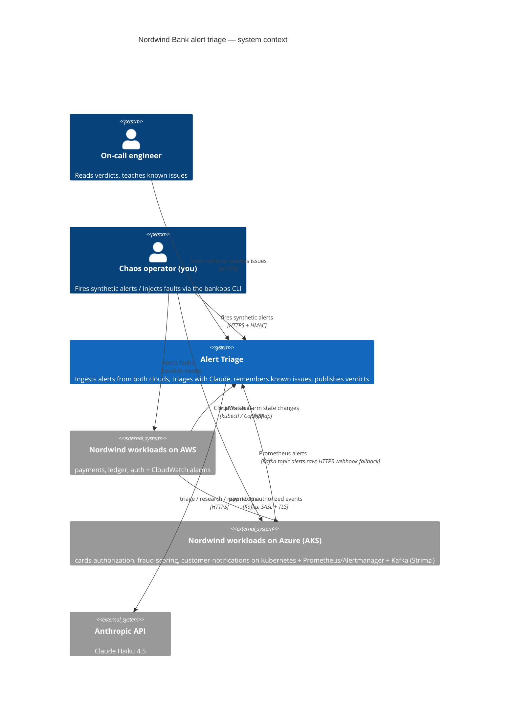
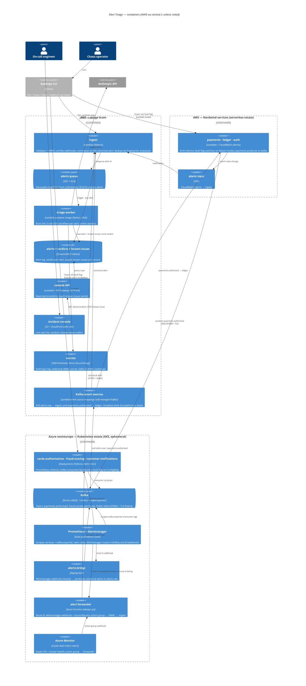
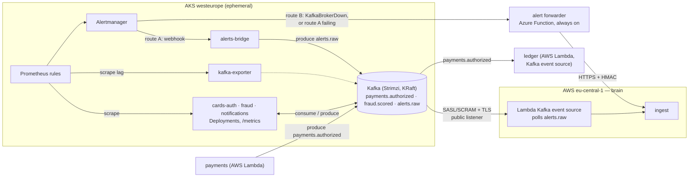
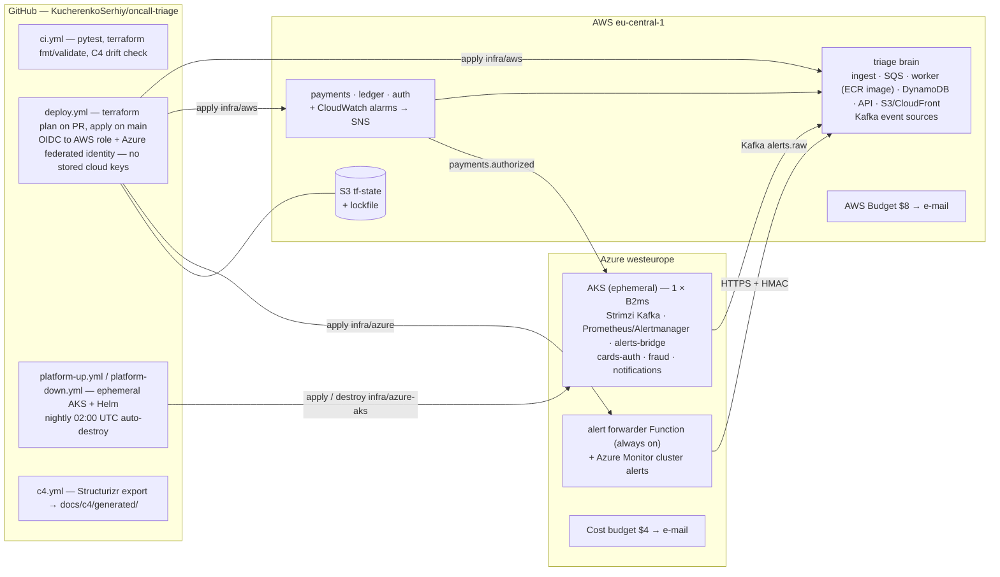

# Nordwind Bank — cloud alert triage: design

Status: **proposal for review** (2026-09-07). Nothing below is built yet.
Decisions already taken with the owner are marked ✅; open ones are in
§10.

## 1. What we are building, in one paragraph

Today `oncall-triage` is a three-role ADK agent that reads mock logs from
a Python dict. We turn it into the alert-triage service of a fictional
bank, *Nordwind Bank*, whose workloads run on **both AWS and Azure** in
the two paradigms real banks actually mix: a **serverless estate on AWS**
(Lambda + CloudWatch) and a **Kubernetes estate on Azure** (AKS with
Prometheus/Alertmanager) joined by a **Kafka event backbone** (Strimzi,
in-cluster). Cloud-native alarms, Prometheus alerts arriving over Kafka,
and a synthetic alert-firing client all flow into one triage brain
hosted on AWS. The brain recognises known issues from a persistent
memory, researches new ones with Claude, and publishes verdicts to an
incident console. Every piece of infrastructure is Terraform (+ Helm for
in-cluster software); every diagram is C4-as-code that CI checks against
the deployed resources. Total cloud spend target: **≤ $10 / month**,
achieved by running the Kubernetes platform **ephemerally** (spun up per
demo session, auto-destroyed) with hard budget alarms at $8 (AWS) and
$4 (Azure).

## 2. Decisions taken ✅

| # | Decision | Choice | Why |
|---|---|---|---|
| D1 | Cloud topology | **Split roles**: triage brain + memory on AWS; bank services and native alert sources on both AWS and Azure | Realistic multi-cloud bank (SRE tooling in one cloud, workloads in two); each cloud does something different; one LLM path to secure and pay for |
| D2 | IaC | **Terraform** (one language, both providers) | Multi-cloud default; the skill the market names |
| D3 | Delivery surface | **Incident console** static web page | Demo surface with zero moving parts; Slack/Teams/email are v2 adapters |
| D4 | Model | **Claude Haiku 4.5 via ADK's LiteLLM adapter** | Quality over free-tier 503 roulette; ~$2–3/month at demo volume, billed outside the $10 |
| D5 | Regions | AWS `eu-central-1`, Azure `westeurope` | EU bank narrative (data residency); both regions carry every service we use |
| D6 | Kubernetes + Kafka | **Included** ✅ — the Azure half of the bank runs on **AKS** with **Prometheus + Alertmanager**; **Kafka via Strimzi** in-cluster is the bank's event backbone and an alert transport | "Used everywhere" — a triage system that has never seen an Alertmanager webhook or a consumer-lag alert isn't credible in a bank. How to afford it is O6 |

## 3. The bank (simulated)

Six services, three per cloud, each with a realistic failure repertoire
that the chaos client can trigger on demand. All are tiny functions that
mostly sleep and emit metrics — the point is the *alerts*, not the
business logic.

| Service | Runs on | What it pretends to do | Failure modes (chaos) | Native alarm |
|---|---|---|---|---|
| `payments` | AWS Lambda | card payment authorisation API; **produces** `payments.authorized` to Kafka | `errors` (5xx burst), `latency` (p99 > 2 s), `pool` (connection pool exhausted — the seeded known issue) | CloudWatch alarm on Lambda `Errors`, `Duration` p99 |
| `ledger` | AWS Lambda (Kafka event source mapping) | double-entry posting; **consumes** `payments.authorized` | `reconciliation-mismatch`, `lag` (stops consuming → consumer lag grows) | Prometheus `kafka_consumergroup_lag` rule (via Strimzi's kafka-exporter) + CloudWatch on Lambda `Errors` |
| `auth` | AWS Lambda | token issuance / JWKS | `jwks-rotation` (unknown key id), `lockouts` | CloudWatch alarm on custom metric `AuthFailures` |
| `cards-authorization` | AKS Deployment | ISO-8583-ish auth switch; Prometheus `/metrics` | `timeouts`, `issuer-down` | Prometheus rule on `http_request_duration_seconds` p99 / error ratio |
| `fraud-scoring` | AKS Deployment | ML scoring; **consumes** `payments.authorized`, **produces** `fraud.scored` | `model-drift` (score distribution shift), `latency`, `crashloop` (pod restarts) | Prometheus rule on custom `fraud_score_bucket` drift + `kube_pod_container_status_restarts_total` |
| `customer-notifications` | AKS Deployment | SMS/e-mail fan-out; **consumes** `fraud.scored` | `provider-429`, `backlog` | Prometheus rule on consumer lag + `PodNotReady` |
| *(platform)* | AKS | Kafka broker (Strimzi, KRaft, 1 node), Prometheus, Alertmanager | `broker-down` (scale Kafka to 0) | Azure Monitor metric alert on node CPU / cluster health; Alertmanager `KafkaBrokerDown` |

Known-issues memory ships pre-seeded per service (e.g. `payments`:
"connection pool exhausted during batch window 02:00–02:30 is expected,
autoscaler lag, no page"), so the known-vs-new split is demonstrable on
day one, exactly as the current repo does.

## 4. Architecture

### 4.1 C4 — system context



### 4.2 C4 — containers



### 4.3 The triage worker — components

The existing three roles survive intact; only the tools change.

| Component | Today | Cloud version |
|---|---|---|
| `triage` root agent | `get_logs(service)` from a dict | `get_alert(alert_id)` → canonical alert incl. sample log lines the service emitted; `get_recent_alerts(service, 30m)` for blast-radius context |
| `check_known` | substring match in `known_issues.json` | same matching (v1), backed by DynamoDB `known_issues` table keyed by service; `TRIAGE_STORE_PATH` seam becomes a `KnownIssueStore` interface with `JsonFileStore` (tests, local) and `DynamoStore` (cloud) |
| `researcher` | reasoning only | unchanged — deliberately tool-less |
| `reporter` | two formats | two formats + a machine-readable verdict block `{severity, action: page|monitor|ack, known: bool}` the console renders as chips |
| `remember_issue` | append to JSON | put to DynamoDB; also callable from the console (teach) |
| model | `gemini-3.5-flash-lite` | `LiteLlm(model="anthropic/claude-haiku-4-5-20251001")`; model id + prompt hash stored on every verdict for audit |
| runtime | `adk web` | ADK `Runner` + `InMemorySessionService` per invocation inside a Lambda handler triggered by SQS (one alert = one session; nothing long-lived) |

### 4.4 Kubernetes and Kafka — where they live and why ephemeral

Two estates, on purpose: real banks run a Kubernetes estate (usually
older, Prometheus-monitored) next to newer serverless services, glued by
Kafka. The Azure half of Nordwind is that Kubernetes estate; Kafka is
both the **business event backbone** (`payments.authorized` produced on
AWS, consumed on Azure by `fraud-scoring`, whose `fraud.scored` feeds
`customer-notifications`; `ledger` on AWS consumes back via a Lambda
Kafka event source) and an **alert transport** (`alerts.raw`).

Two alert routes out of the cluster, and the choice between them is the
demo:

- **Route A — over Kafka**: Prometheus rule → Alertmanager → `alerts-bridge`
  (webhook receiver that produces canonical alerts to `alerts.raw`) →
  Lambda Kafka event source on AWS → `ingest`. Cross-cloud consumption of
  a Kafka topic by a serverless function, no polling code of our own.
- **Route B — over HTTPS**: Alertmanager → `alert forwarder` Function →
  HMAC → `ingest`. Used for the alerts that *cannot* travel over Kafka —
  `KafkaBrokerDown`, consumer-lag on the bridge itself — and as fallback
  when route A's delivery fails. The `broker-down` chaos mode makes this
  visible: the alert about Kafka arrives, and it did not come via Kafka.



**Why ephemeral.** An always-on AKS node is ≈ $36–72/month by itself;
managed Kafka (MSK, Event Hubs Standard) is more. Instead the whole
Kubernetes estate is a Terraform root module + Helm releases that
GitHub Actions brings up for a session and tears down after:

| Step | What happens | Time | Cost |
|---|---|---|---|
| `platform up` | `terraform apply infra/azure-aks` (AKS Free tier control plane, 1 × `Standard_B2ms` node) → Helm: Strimzi, kube-prometheus-stack, bank charts → enable the two Lambda Kafka event sources → smoke probe | ≈ 10–12 min | ≈ $0.15/hour while up |
| `platform stop` (intra-week) | `az aks stop` — deallocates the node, keeps state; control plane stays free | 2 min | ≈ $0.10/month for disks |
| `platform down` | disable event sources → `terraform destroy` | 5 min | $0 |
| nightly guard | scheduled workflow at 02:00 UTC destroys anything still up | — | the budget's real backstop |

Twenty hours of demo per month ≈ **$3**. Daily development happens on a
local `kind` cluster with the *same* Helm values — the cloud is for the
cross-cloud path, not for iterating on YAML. The always-on pieces on
Azure (alert forwarder, Azure Monitor rules, budget) live in the separate
`infra/azure` root module so `destroy` never touches them.

### 4.5 Deployment view



## 5. The alert path, end to end


The synthetic path (`bankops fire --service fraud-scoring --alert model-drift`)
skips the first four lines and posts a canonical alert to `ingest`
directly — same HMAC, same downstream. The Azure path replaces
CloudWatch/SNS with Azure Monitor → action group → `alert forwarder`
(Azure action groups cannot add custom auth headers, so the forwarder is
where the HMAC signature is applied — and it gives Azure a real
cross-cloud egress component to draw).

## 6. Canonical alert schema

```json
{
  "alert_id": "ulid",
  "fingerprint": "sha256(source, service, alert_name, labels)",
  "source": "cloudwatch | azure-monitor | bankops",
  "cloud": "aws | azure",
  "service": "payments",
  "alert_name": "HighErrorRate",
  "severity": "sev1 | sev2 | sev3 | sev4",
  "title": "payments 5xx rate above 5% for 5 min",
  "description": "free text from the source",
  "sample_logs": ["ERROR ... connection pool exhausted ..."],
  "labels": { "env": "prod", "region": "eu-central-1", "runbook": "RB-PAY-004" },
  "fired_at": "RFC3339",
  "received_at": "RFC3339",
  "raw": { "...source payload, PAN/IBAN-scrubbed..." }
}
```

Dedup: an alert with an existing `fingerprint` still `firing` within 30
min is attached to the open alert (counter++) instead of re-triaged —
protects the LLM budget from alarm flapping.

## 7. Security posture (what "bank" buys us)

- **No long-lived cloud keys anywhere.** GitHub Actions assumes an AWS IAM
  role via OIDC and an Azure app registration via federated credential.
  Your laptop uses SSO/az login for bootstrap only.
- **Webhooks are HMAC-signed** (`X-Nordwind-Signature: sha256=…` over
  timestamp + body, 5-min replay window). SNS → ingest is a direct Lambda
  subscription (no public endpoint). The forwarder holds the HMAC secret
  in Key Vault; ingest reads it from SSM SecureString.
- **PII never reaches the model.** Ingest scrubs PAN (Luhn-valid 13–19
  digit runs), IBAN, and e-mail patterns from `description`, `sample_logs`
  and `raw` before storage. A test suite asserts the scrubber on a corpus.
- **Least privilege per function**: ingest can put to two tables + one
  queue; worker can read/write its tables and read one SSM parameter;
  the console API has no SQS access; nothing has `*`.
- **Audit trail**: every verdict stores model id, prompt template hash,
  input alert id, and token counts. Console shows "who taught what, when".
- **Encryption at rest** is default (DynamoDB, S3, SQS SSE, Key Vault);
  CloudFront enforces TLS; API Gateway throttled at 10 rps / 20 burst.
- Console access (v1): a bearer token in the browser (entered once,
  localStorage), checked by the console API. v2: Cognito or Entra ID SSO.

## 8. Cost model (steady state, after 12-month free tiers expire)

| Line | Assumption | $/month |
|---|---|---|
| Lambda (ingest, worker, API, 3 services) | ~50k invocations, worker 2 GB × 40 s × 300 alerts | 0 (always-free 1M req / 400k GB-s) |
| SQS, SNS, EventBridge | < 100k messages | 0 (always-free) |
| DynamoDB | 3 tables, provisioned 5 RCU/5 WCU each, < 1 GB | 0 (always-free 25/25) |
| CloudWatch | ≤ 10 alarms, ≤ 10 custom metrics, < 1 GB logs | 0 (always-free); each extra custom metric $0.30 |
| API Gateway HTTP API | < 100k calls | ~0.10 |
| S3 + CloudFront | console < 1 MB, < 1 GB egress | ~0.05 |
| ECR (worker image ~700 MB) | private repo | ~0.07 |
| SSM Parameter Store (standard) | 2 SecureStrings | 0 |
| AWS Budgets | 1 budget | 0 (first two free) |
| Azure Functions (3 services + forwarder) | consumption, < 100k executions | 0 (1M grant) |
| Azure Storage (function hosting + queue) | < 1 GB, LRS | ~0.20 |
| Application Insights / Log Analytics | < 0.5 GB ingested | 0 (5 GB free) |
| Azure Monitor alert rules | 3 metric (10 free series), 1 log alert | ~0.50 |
| Azure action group webhooks | < 1,000 | 0 |
| AKS control plane | Free tier | 0 |
| AKS node `Standard_B2ms` (2 vCPU, 8 GiB) | ≈ $0.10/h × ~20 h of demo sessions | ~2.00 |
| Standard load balancer + public IP for the Kafka listener | ≈ $0.03/h × 20 h | ~0.60 |
| Managed disks (Kafka + Prometheus PVCs, created/destroyed with the platform) | 2 × 32 GB, pro-rated | ~0.20 |
| Container Insights | **deliberately off** (it is the $2.30/GB trap); metric alerts only | 0 |
| **Cloud total** | | **≈ $4–5**; worst case ≈ $8 with 20 extra custom metrics and 40 platform hours |
| *Always-on AKS alternative* | B2ms 24 × 7 ≈ $72, B2s (4 GiB, tight) ≈ $36 | *needs a ≈ $50 budget — see O6* |
| Anthropic API (outside the $10) | 300 alerts × 3 turns × (~3k in + ~700 out) at Haiku 4.5 $1/$5 per MTok | ≈ 2.5 |

Guardrails: AWS Budget at $8 and Azure budget at $4 both e-mail you;
the worker refuses to call the model past 500 alerts/day (DynamoDB
counter) — a flapping alarm can't run up the Anthropic bill overnight.

## 9. Diagrams as code, and keeping them honest

- **Source of truth: `docs/c4/workspace.dsl`** (Structurizr DSL) — one
  model, four views: system context, containers, worker components,
  deployment (AWS + Azure). `c4.yml` runs the `structurizr/cli` Docker
  image to export Mermaid + PNG into `docs/c4/generated/`, so GitHub
  renders them and PRs show diagram diffs.
- **Drift check in CI**: every Terraform resource carries a
  `c4_container` tag; `scripts/c4_drift.py` compares the set of tag values
  in `terraform show -json` against container identifiers in the DSL and
  fails the build on any container that exists in one place and not the
  other. Diagrams that lie fail CI, same as tests.
- The Mermaid blocks in this document are the *design-time* sketch; once
  the DSL exists they are replaced by the generated exports.

## 10. Open decisions (need your call)

| # | Question | Options | My recommendation |
|---|---|---|---|
| O1 | Console auth in v1 | bearer token in browser · Cognito hosted UI · none (private CloudFront + IP allowlist) | bearer token — 20 lines, no new service, upgrade path clear |
| O2 | Structurizr DSL vs Mermaid-C4-only | DSL + CI export (needs Docker in CI, has deployment views + drift check) · Mermaid C4 hand-maintained | Structurizr DSL — the drift check is the whole point of "IaC fashion" |
| O3 | Chaos scheduling | on-demand only via CLI · plus an hourly EventBridge "random incident" rule (capped 10/day) for a living demo | add the scheduler in M7, off by default |
| O4 | Custom domain | none (CloudFront/API default hostnames) · Route 53 zone (+$0.50/month) | none for v1 |
| O5 | Where `oncall-triage` docs live | this repo (monorepo: agent + infra + bank + console + cli + platform) · split infra repo | monorepo — one PR changes code, infra, and diagram together |
| O6 | How to afford Kubernetes + Kafka | **ephemeral AKS + in-cluster Strimzi** (≈ $3/month, cluster up only for sessions) · always-on AKS (budget → ≈ $50/month) · ephemeral AKS + **Confluent Cloud Basic** for Kafka (usage-billed ≈ $1/month, Kafka reachable even when the cluster is down, third-party SaaS) | ephemeral + Strimzi for v1; Confluent is a drop-in v2 swap since the protocol and client config are identical |

## 11. Milestones (each with an offline gate and a live probe)

| M | Deliverable | Offline gate (CI) | Live probe |
|---|---|---|---|
| M0 | Repo on GitHub ✅, `ci.yml` running pytest, repo layout from §12, this design merged | 14 tests green in Actions | — |
| M1 | Terraform bootstrap: state bucket, OIDC role (AWS), federated identity (Azure), budgets, `infra/aws` + `infra/azure` skeletons that `plan` clean | `terraform validate` + `tflint` | `deploy.yml` applies an empty stack from a PR merge |
| M2 | Alert spine without LLM: ingest (HMAC, scrubber, dedup) → DynamoDB → SQS → stub worker; console API + static console; `bankops fire` | pytest for scrubber/HMAC/dedup/schema; console renders fixtures | `bankops fire --service payments` appears on the console in < 5 s |
| M3 | Real triage worker: ADK on Lambda container, LiteLLM → Claude, `KnownIssueStore` interface + DynamoStore, teach from console | existing wiring tests + store contract tests against moto | fire known → FORMAT A; fire new → FORMAT B; teach → re-fire → FORMAT A |
| M4 | AWS bank services + CloudWatch alarms + SNS → ingest; `bankops chaos` for AWS | unit tests for fault modes | chaos payments errors → alarm → verdict within ~3 min |
| M5 | Kubernetes estate: `infra/azure-aks` (AKS Free tier, 1 node) + Helm (kube-prometheus-stack, bank charts), the three Azure services as Deployments with `/metrics`, Prometheus rules, Alertmanager → forwarder (route B), `platform up|stop|down` workflows + nightly guard; `bankops chaos` via ConfigMap; local `kind` parity | Helm `lint` + `kubeconform`; chart tests on `kind` in CI; forwarder HMAC tests | `platform up` < 12 min; chaos cards-authorization timeouts → Prometheus → Alertmanager → forwarder → verdict within ~4 min; `platform down` leaves $0/h |
| M6 | Kafka backbone: Strimzi (KRaft) + topics + SCRAM users + public TLS listener; `payments` (AWS) produces, `fraud-scoring`/`customer-notifications` consume/produce, `ledger` consumes via Lambda event source; `alerts-bridge` (route A); kafka-exporter + consumer-lag rules | producer/consumer contract tests against a `testcontainers` Redpanda; bridge unit tests | chaos ledger lag → `KafkaConsumerLag` travels **over Kafka** → verdict; chaos broker-down → `KafkaBrokerDown` arrives via route B |
| M7 | C4 pipeline: `workspace.dsl` (incl. deployment view with the AKS node), `c4.yml` export, `c4_drift.py` gate over Terraform tags **and** Helm release labels; ADRs for D1–D6 | drift check green; a deliberately untagged resource fails it | — |
| M8 | Hardening: DLQ alarm, worker daily cap, per-service known-issue seeds, optional random-incident scheduler, README demo script | full suite | 24 h soak under scheduler (platform down) stays < $0.50 |

Build method: M2–M5 code is written by **dev-loop** against tight specs
(offline-verifiable parts); Terraform applies and live probes stay
human-in-the-loop because they need your credentials — exactly the
"intervene only on real blockers" contract.

## 12. Repository layout (target)

```
oncall-triage/
  oncall_triage/            ADK agents + tools (existing) + stores/{json,dynamo}.py
  services/
    ingest/                 Lambda: webhooks → canonical alert → DynamoDB + SQS
    triage_worker/          Lambda container: SQS → ADK Runner → verdict
    console_api/            Lambda: read alerts/verdicts, teach known issues
  bank/
    aws/{payments,ledger,auth}/      Lambdas with fault flags (payments/ledger = Kafka producer/consumer)
    azure/{cards_authorization,fraud_scoring,customer_notifications,alerts_bridge}/
                            container images (Dockerfiles), Prometheus /metrics, Kafka clients
    azure/alert_forwarder/  Azure Function (always on)
  platform/                 the Kubernetes estate as code
    charts/nordwind-bank/   Helm chart for the three services + alerts-bridge (fault flag = ConfigMap)
    kafka/                  Strimzi CRs: Kafka (KRaft), KafkaTopic × 3, KafkaUser × n
    monitoring/             kube-prometheus-stack values, PrometheusRule files, Alertmanager routes A/B
    kind/                   local cluster config + the same values files
  console/                  static site (vanilla JS, no build step)
  cli/bankops/              fire · chaos · teach · tail · platform up|stop|down
  infra/
    modules/{lambda_fn,dynamo_table,kafka_event_source,azure_function,aks_cluster,...}
    aws/                    root module (brain + AWS bank services + Kafka event sources)
    azure/                  root module (always-on: forwarder, Azure Monitor rules, budget)
    azure-aks/              root module (ephemeral: AKS + Helm releases) — separately destroyable
  docs/
    DESIGN.md               this file
    adr/                    0001-split-roles.md … 0006-k8s-kafka-ephemeral.md
    c4/workspace.dsl, c4/generated/
  scripts/c4_drift.py
  .github/workflows/{ci,deploy,platform-up,platform-down,c4}.yml
```

## 13. What I need from you before M1

1. **AWS account**: an IAM identity (or SSO) I can use once to bootstrap
   the OIDC role + state bucket; after that, GitHub Actions deploys.
2. **Azure subscription**: `az login` once (or a service principal) to
   create the resource group, app registration and federated credential.
3. **Anthropic API key** (goes into SSM SecureString via a GitHub secret).
4. A billing e-mail for the two budget alerts.
5. Your calls on O1–O5.

## 14. Risks

| Risk | Mitigation |
|---|---|
| ADK + deps make the worker image large; Lambda cold start 5–10 s | Async path via SQS tolerates it; provisioned concurrency is *not* in budget — accept latency |
| Alarm flapping → LLM cost spike | fingerprint dedup + 500/day cap + budget alarms |
| Azure Monitor metric alerts evaluate at 1-min granularity; end-to-end demo latency ~3–5 min | scripted demo uses `bankops fire` for the instant path, chaos for the realistic one |
| Free-tier changes | cost model assumes *always-free* lines only; 12-month lines counted at list price |
| Cross-cloud secret sprawl (HMAC in both clouds) | one secret, rotated by a Terraform `random_password` re-apply; forwarder and ingest read it at cold start |
| Platform left running → ≈ $72/month surprise | nightly auto-destroy workflow, `platform stop` for intra-week pauses (node deallocated, control plane free), Azure budget alert at $4, and the AKS node count is hard-coded to 1 |
| Kafka reachable from the internet (public listener for AWS) | SASL/SCRAM + TLS, per-client `KafkaUser` ACLs (payments: write one topic; event sources: read two), credentials regenerated on every `platform up`; listener exists only while the platform does |
| Lambda Kafka event sources error while the cluster is down | `platform down` disables them first; `platform up` re-enables last; CloudWatch alarm on event-source errors is itself a triage alert |
| One node = no HA; a Kafka broker restart drops the estate for a minute | accepted — this is a demo estate; the `broker-down` chaos mode turns the weakness into the route-B demo |
| Memory pressure on a single B2ms (Kafka + Prometheus + services) | JVM heap capped at 768 MB, Prometheus retention 2 h, requests/limits on every pod; `platform up` fails fast if the node reports memory pressure |
