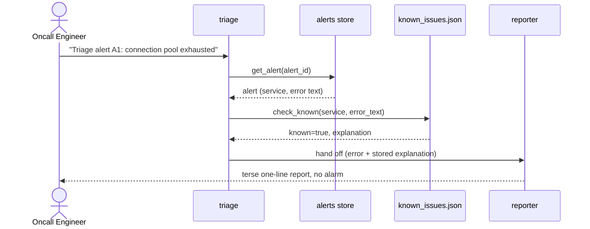
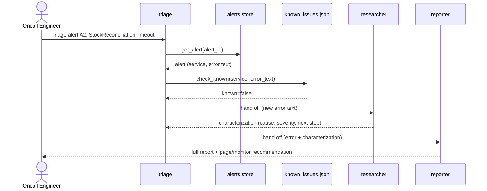

# The triage agent (phase 1)

A three-role agent workflow, built on Google ADK, that triages service log
errors: it recognizes previously-explained known issues, researches
genuinely new ones, and reports with a verbosity matched to the case.

## Roles and flow

- **triage** (root agent) — fetches the alert via `get_alert` (optionally
  `get_recent_alerts` for blast-radius context) and checks its error text
  against the known-issues store via `check_known`.
  - Known match → hands off directly to **reporter**.
  - New error → hands off to **researcher** first, then **reporter**.
  - The routing is genuine ADK dynamic delegation (`sub_agents` +
    description-driven transfer), not a fixed sequential pipeline — the
    model decides which sub-agent to invoke based on what `check_known`
    returned.
- **researcher** (sub-agent) — given a new error's text, reasons out a
  short characterization: likely cause category, severity guess, and a
  suggested next diagnostic step. No external services, reasoning only.
- **reporter** (sub-agent) — formats the final answer:
  - Known issue → one terse line citing the stored explanation, no alarm.
  - New issue → a fuller report: the error, the researcher's
    characterization, and a recommendation to page or monitor.

You can also teach the system: a message like "the connection pool
exhausted error in payments-service is expected, because it's a known
scaling limit" causes triage to call `remember_issue` and persist it to
the known-issues store.

## Known-issues store

A local JSON file, `known_issues.json` in the repo root by default
(override with the `TRIAGE_STORE_PATH` env var). It ships pre-seeded with
one known issue (`connection pool exhausted`) so the known-issue path is
demonstrable immediately. A production deployment would swap this for
Vertex AI Memory Bank; that's out of scope here.

## Sequence diagrams

### Known-issue path



### New-issue path



## Setup

```bash
pip install -r requirements.txt
cp .env.example .env   # then fill in ANTHROPIC_API_KEY
```

## Run

From the repo root:

```bash
adk web
```

or:

```bash
adk run oncall_triage
```

The local `AlertRepo` (default when no AWS is configured) starts empty, so
`get_alert`/`get_recent_alerts` won't find anything until you seed one -
the one prompt that works out of the box is teaching a known issue:

- "the NullPointerException in RefundCalculator error in
  payments-service is expected, because it's a known null-safety bug
  with a fix scheduled" (calls `remember_issue`)

To exercise the known/new-issue routing end to end, either seed
`oncall_triage.tools._alert_repo` with an alert before starting `adk web`,
or run the deployed worker against real DynamoDB data - see
`services/triage_worker/README.md`.

No API key is required to import the agent module or run the test suite —
only actually talking to the model (via `adk web`/`adk run`) needs
`ANTHROPIC_API_KEY`.

## Tests

```bash
pytest
```

All tests are structural/wiring checks (agent wiring, tool behavior,
store persistence, instruction content) — none of them make a live model
call or require an API key.

## Phase 2: the deployed worker

This page describes running the agent standalone via `adk web`/`adk run`.
The deployed version - Claude Haiku 4.5 through ADK's LiteLLM adapter,
DynamoDB-backed tools, a verdict contract with a trailing fenced JSON
block, a daily alert cap, running per-alert inside the SQS-triggered
Lambda - is `services/triage_worker/`; see
`services/triage_worker/README.md`.
