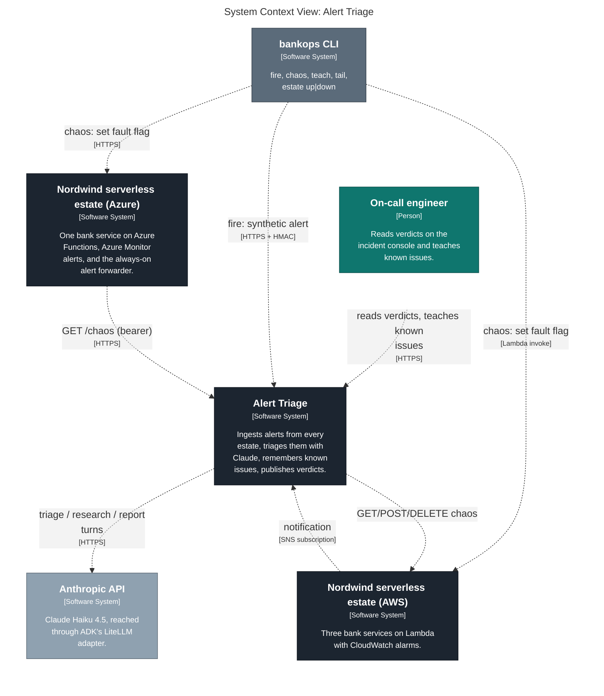
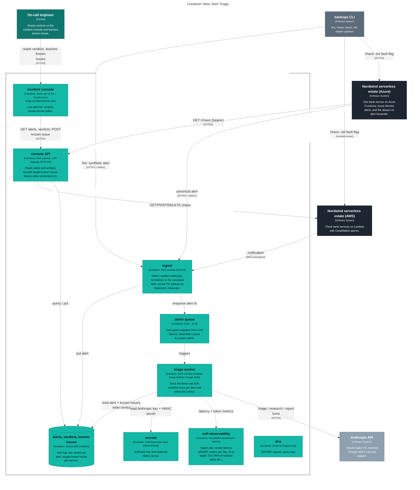
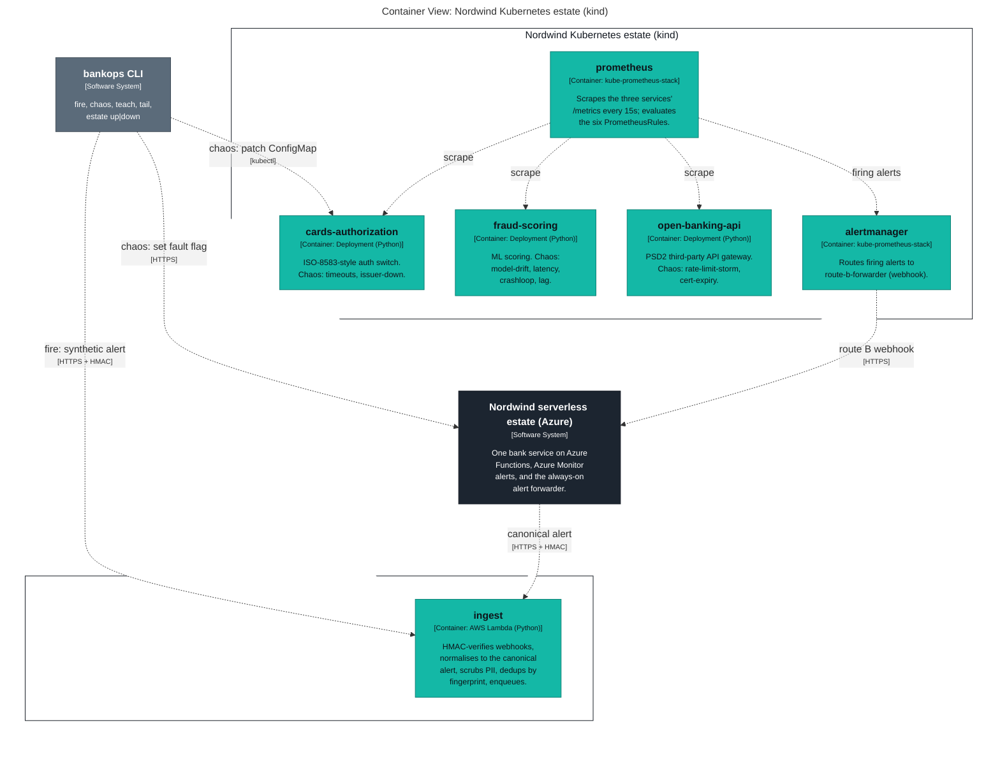
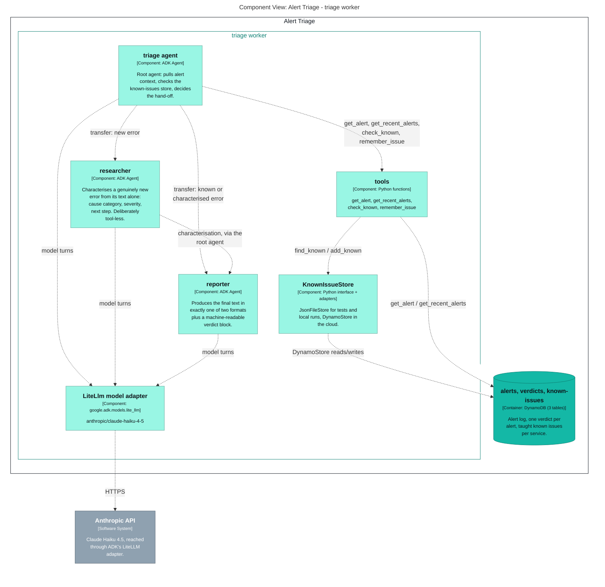

# Generated C4 diagrams

Exported from [`../workspace.dsl`](../workspace.dsl) by `task c4`; do not edit by hand.

## Level 1 — system context

## Level 2 — the triage brain and its inbound sources

## Level 2 — the Kubernetes estate: services, Prometheus, Alertmanager route B

## Level 3 — inside the triage worker

## Deployment — where every container runs in `demo` (AWS, Azure)

```mermaid
graph LR
  linkStyle default fill:#ffffff

  subgraph diagram ["Deployment View: demo"]
    style diagram fill:#ffffff,stroke:#ffffff

    subgraph 104 ["AWS"]
      style 104 fill:#ffffff,stroke:#444444,color:#444444

      subgraph 105 ["Lambda"]
        style 105 fill:#ffffff,stroke:#444444,color:#444444

        106["<div style='font-weight: bold'>ingest</div><div style='font-size: 70%; margin-top: 0px'>[Container: AWS Lambda (Python)]</div><div style='font-size: 80%; margin-top:10px'>HMAC-verifies webhooks,<br />normalises to the canonical<br />alert, scrubs PII, dedups by<br />fingerprint, enqueues.</div>"]
        style 106 fill:#14b8a6,stroke:#0e8074,color:#0e1419
        107["<div style='font-weight: bold'>triage worker</div><div style='font-size: 70%; margin-top: 0px'>[Container: AWS Lambda container image (Python, Google ADK)]</div><div style='font-size: 80%; margin-top:10px'>Runs the three-role ADK<br />workflow once per alert and<br />writes the verdict.</div>"]
        style 107 fill:#14b8a6,stroke:#0e8074,color:#0e1419
        108["<div style='font-weight: bold'>payments</div><div style='font-size: 70%; margin-top: 0px'>[Container: AWS Lambda (Python)]</div><div style='font-size: 80%; margin-top:10px'>Card payment authorisation<br />API. Chaos: errors, latency,<br />pool.</div>"]
        style 108 fill:#14b8a6,stroke:#0e8074,color:#0e1419
        109["<div style='font-weight: bold'>ledger</div><div style='font-size: 70%; margin-top: 0px'>[Container: AWS Lambda (Python)]</div><div style='font-size: 80%; margin-top:10px'>Double-entry posting worker<br />fed by SQS. Chaos:<br />reconciliation-mismatch, lag.</div>"]
        style 109 fill:#14b8a6,stroke:#0e8074,color:#0e1419
        110["<div style='font-weight: bold'>auth</div><div style='font-size: 70%; margin-top: 0px'>[Container: AWS Lambda (Python)]</div><div style='font-size: 80%; margin-top:10px'>Token issuance / JWKS. Chaos:<br />jwks-rotation, lockouts.</div>"]
        style 110 fill:#14b8a6,stroke:#0e8074,color:#0e1419
      end

      subgraph 111 ["API Gateway"]
        style 111 fill:#ffffff,stroke:#444444,color:#444444

        112["<div style='font-weight: bold'>console API</div><div style='font-size: 70%; margin-top: 0px'>[Container: AWS Lambda + API Gateway HTTP API]</div><div style='font-size: 80%; margin-top:10px'>Reads alerts and verdicts;<br />accepts taught known issues.<br />Bearer-token protected (v1).</div>"]
        style 112 fill:#14b8a6,stroke:#0e8074,color:#0e1419
      end

      subgraph 113 ["SQS"]
        style 113 fill:#ffffff,stroke:#444444,color:#444444

        114["<div style='font-weight: bold'>alerts queue</div><div style='font-size: 70%; margin-top: 0px'>[Container: SQS + DLQ]</div><div style='font-size: 80%; margin-top:10px'>Decouples ingestion from LLM<br />latency; dead-letter queue<br />for poison alerts.</div>"]
        style 114 fill:#14b8a6,stroke:#0e8074,color:#0e1419
        117["<div style='font-weight: bold'>ledger queue</div><div style='font-size: 70%; margin-top: 0px'>[Container: SQS + DLQ]</div><div style='font-size: 80%; margin-top:10px'>Decouples payments from<br />ledger posting; DLQ after 5<br />failed attempts.</div>"]
        style 117 fill:#14b8a6,stroke:#0e8074,color:#0e1419
      end

      subgraph 120 ["SNS"]
        style 120 fill:#ffffff,stroke:#444444,color:#444444

        121["<div style='font-weight: bold'>alarm topic</div><div style='font-size: 70%; margin-top: 0px'>[Container: SNS]</div><div style='font-size: 80%; margin-top:10px'>CloudWatch alarm state<br />changes fan out here.</div>"]
        style 121 fill:#14b8a6,stroke:#0e8074,color:#0e1419
      end

      subgraph 126 ["DynamoDB"]
        style 126 fill:#ffffff,stroke:#444444,color:#444444

        127[("<div style='font-weight: bold'>alerts, verdicts, known-issues</div><div style='font-size: 70%; margin-top: 0px'>[Container: DynamoDB (3 tables)]</div><div style='font-size: 80%; margin-top:10px'>Alert log, one verdict per<br />alert, taught known issues<br />per service.</div>")]
        style 127 fill:#14b8a6,stroke:#0e8074,color:#0e1419
        131[("<div style='font-weight: bold'>faults</div><div style='font-size: 70%; margin-top: 0px'>[Container: DynamoDB]</div><div style='font-size: 80%; margin-top:10px'>One fault flag per service,<br />set by bankops chaos or the<br />console API.</div>")]
        style 131 fill:#14b8a6,stroke:#0e8074,color:#0e1419
      end

      subgraph 136 ["CloudFront + S3"]
        style 136 fill:#ffffff,stroke:#444444,color:#444444

        137["<div style='font-weight: bold'>incident console</div><div style='font-size: 70%; margin-top: 0px'>[Container: Static site on S3 + CloudFront at triage.serhiykucherenko.dev]</div><div style='font-size: 80%; margin-top:10px'>Live alert list, verdicts,<br />known-issues editor.</div>"]
        style 137 fill:#14b8a6,stroke:#0e8074,color:#0e1419
      end

      subgraph 139 ["SSM"]
        style 139 fill:#ffffff,stroke:#444444,color:#444444

        140["<div style='font-weight: bold'>secrets</div><div style='font-size: 70%; margin-top: 0px'>[Container: SSM Parameter Store (SecureString)]</div><div style='font-size: 80%; margin-top:10px'>Anthropic key and webhook<br />HMAC secret.</div>"]
        style 140 fill:#14b8a6,stroke:#0e8074,color:#0e1419
      end

      subgraph 142 ["CloudWatch"]
        style 142 fill:#ffffff,stroke:#444444,color:#444444

        143["<div style='font-weight: bold'>self-observability</div><div style='font-size: 70%; margin-top: 0px'>[Container: CloudWatch dashboard + alarms]</div><div style='font-size: 80%; margin-top:10px'>Ingest rate, verdict latency<br />p50/p95, tokens per day, DLQ<br />depth; SLO 95% of verdicts<br />within 90 s.</div>"]
        style 143 fill:#14b8a6,stroke:#0e8074,color:#0e1419
      end

      subgraph 145 ["Route 53"]
        style 145 fill:#ffffff,stroke:#444444,color:#444444

        146["<div style='font-weight: bold'>dns</div><div style='font-size: 70%; margin-top: 0px'>[Container: Route 53 hosted zone]</div><div style='font-size: 80%; margin-top:10px'>DNSSEC-signed; query logs</div>"]
        style 146 fill:#14b8a6,stroke:#0e8074,color:#0e1419
      end

      subgraph 147 ["ECR"]
        style 147 fill:#ffffff,stroke:#444444,color:#444444

        148["<div style='font-weight: bold'>triage-worker image</div><div style='font-size: 70%; margin-top: 0px'>[Infrastructure Node]</div><div style='font-size: 80%; margin-top:10px'>Immutable image tagged by git<br />SHA (also `:latest`); built<br />and pushed by deploy.yml's<br />`image` job, run by the<br />Lambda above.</div>"]
        style 148 fill:#ffffff,stroke:#444444,color:#444444
      end

    end

    subgraph 149 ["AWS (us-east-1)"]
      style 149 fill:#ffffff,stroke:#444444,color:#444444

      subgraph 150 ["KMS"]
        style 150 fill:#ffffff,stroke:#444444,color:#444444

        151["<div style='font-weight: bold'>DNSSEC signing key</div><div style='font-size: 70%; margin-top: 0px'>[Infrastructure Node]</div><div style='font-size: 80%; margin-top:10px'>ECC_NIST_P256 asymmetric key<br />(SIGN_VERIFY); Route 53<br />requires it in us-east-1<br />regardless of the stack's own<br />region.</div>"]
        style 151 fill:#ffffff,stroke:#444444,color:#444444
      end

    end

    subgraph 152 ["Azure"]
      style 152 fill:#ffffff,stroke:#444444,color:#444444

      subgraph 153 ["Function App (consumption)"]
        style 153 fill:#ffffff,stroke:#444444,color:#444444

        154["<div style='font-weight: bold'>customer-notifications</div><div style='font-size: 70%; margin-top: 0px'>[Container: Azure Function (Python)]</div><div style='font-size: 80%; margin-top:10px'>SMS / e-mail fan-out. Chaos:<br />provider-429, backlog.</div>"]
        style 154 fill:#14b8a6,stroke:#0e8074,color:#0e1419
        156["<div style='font-weight: bold'>alert forwarder</div><div style='font-size: 70%; margin-top: 0px'>[Container: Azure Function (Python)]</div><div style='font-size: 80%; margin-top:10px'>Receives Azure Monitor<br />action-group calls and<br />Alertmanager route-B<br />webhooks, signs with HMAC,<br />posts to ingest.</div>"]
        style 156 fill:#14b8a6,stroke:#0e8074,color:#0e1419
      end

      subgraph 158 ["Application Insights + Log Analytics"]
        style 158 fill:#ffffff,stroke:#444444,color:#444444

        159["<div style='font-weight: bold'>Application Insights</div><div style='font-size: 70%; margin-top: 0px'>[Container: Application Insights + Log Analytics]</div><div style='font-size: 80%; margin-top:10px'>Custom metrics (provider_429,<br />notifications_backlog) and<br />exceptions from<br />customer-notifications; the<br />alert rules query it.</div>"]
        style 159 fill:#14b8a6,stroke:#0e8074,color:#0e1419
      end

      subgraph 161 ["Azure Monitor"]
        style 161 fill:#ffffff,stroke:#444444,color:#444444

        162["<div style='font-weight: bold'>Azure Monitor</div><div style='font-size: 70%; margin-top: 0px'>[Container: Azure Monitor]</div><div style='font-size: 80%; margin-top:10px'>Metric alert rules + action<br />group.</div>"]
        style 162 fill:#14b8a6,stroke:#0e8074,color:#0e1419
      end

    end

    subgraph 164 ["Anthropic"]
      style 164 fill:#ffffff,stroke:#444444,color:#444444

      165["<div style='font-weight: bold'>Anthropic API</div><div style='font-size: 70%; margin-top: 0px'>[Software System]</div><div style='font-size: 80%; margin-top:10px'>Claude Haiku 4.5, reached<br />through ADK's LiteLLM<br />adapter.</div>"]
      style 165 fill:#8fa1b0,stroke:#64707b,color:#ffffff
    end

    subgraph 167 ["Cloudflare"]
      style 167 fill:#ffffff,stroke:#444444,color:#444444

      168["<div style='font-weight: bold'>NS delegation</div><div style='font-size: 70%; margin-top: 0px'>[Infrastructure Node]</div>"]
      style 168 fill:#ffffff,stroke:#444444,color:#444444
    end

    106-. "<div>enqueue alert id</div><div style='font-size: 70%'></div>" .->114
    114-. "<div>triggers</div><div style='font-size: 70%'></div>" .->107
    108-. "<div>enqueue authorisation</div><div style='font-size: 70%'></div>" .->117
    117-. "<div>triggers</div><div style='font-size: 70%'></div>" .->109
    121-. "<div>notification</div><div style='font-size: 70%'>[SNS subscription]</div>" .->106
    108-. "<div>alarm state change</div><div style='font-size: 70%'></div>" .->121
    109-. "<div>alarm state change</div><div style='font-size: 70%'></div>" .->121
    110-. "<div>alarm state change</div><div style='font-size: 70%'></div>" .->121
    106-. "<div>put alert</div><div style='font-size: 70%'></div>" .->127
    107-. "<div>read alert + known issues,<br />write verdict</div><div style='font-size: 70%'></div>" .->127
    112-. "<div>query / put</div><div style='font-size: 70%'></div>" .->127
    108-. "<div>read fault flag</div><div style='font-size: 70%'></div>" .->131
    109-. "<div>read fault flag</div><div style='font-size: 70%'></div>" .->131
    110-. "<div>read fault flag</div><div style='font-size: 70%'></div>" .->131
    112-. "<div>GET/POST/DELETE chaos</div><div style='font-size: 70%'></div>" .->131
    137-. "<div>GET alerts, verdicts; POST<br />known-issue</div><div style='font-size: 70%'>[HTTPS]</div>" .->112
    107-. "<div>read Anthropic key + HMAC<br />secret</div><div style='font-size: 70%'></div>" .->140
    107-. "<div>latency + token metrics</div><div style='font-size: 70%'></div>" .->143
    154-. "<div>GET /chaos (bearer)</div><div style='font-size: 70%'>[HTTPS]</div>" .->112
    156-. "<div>canonical alert</div><div style='font-size: 70%'>[HTTPS + HMAC]</div>" .->106
    154-. "<div>custom metrics</div><div style='font-size: 70%'></div>" .->159
    162-. "<div>action group webhook (common<br />alert schema)</div><div style='font-size: 70%'>[HTTPS]</div>" .->156
    107-. "<div>triage / research / report<br />turns</div><div style='font-size: 70%'>[HTTPS]</div>" .->165

  end
```

## Deployment — where the Kubernetes estate runs (laptop, GitHub Actions)

```mermaid
graph LR
  linkStyle default fill:#ffffff

  subgraph diagram ["Deployment View: kind"]
    style diagram fill:#ffffff,stroke:#ffffff

    subgraph 163 ["Laptop"]
      style 163 fill:#ffffff,stroke:#444444,color:#444444

      subgraph 164 ["kind cluster"]
        style 164 fill:#ffffff,stroke:#444444,color:#444444

        165["<div style='font-weight: bold'>cards-authorization</div><div style='font-size: 70%; margin-top: 0px'>[Container: Deployment (Python)]</div><div style='font-size: 80%; margin-top:10px'>ISO-8583-style auth switch.<br />Chaos: timeouts, issuer-down.</div>"]
        style 165 fill:#14b8a6,stroke:#0e8074,color:#0e1419
        166["<div style='font-weight: bold'>fraud-scoring</div><div style='font-size: 70%; margin-top: 0px'>[Container: Deployment (Python)]</div><div style='font-size: 80%; margin-top:10px'>ML scoring. Chaos:<br />model-drift, latency,<br />crashloop, lag.</div>"]
        style 166 fill:#14b8a6,stroke:#0e8074,color:#0e1419
        167["<div style='font-weight: bold'>open-banking-api</div><div style='font-size: 70%; margin-top: 0px'>[Container: Deployment (Python)]</div><div style='font-size: 80%; margin-top:10px'>PSD2 third-party API gateway.<br />Chaos: rate-limit-storm,<br />cert-expiry.</div>"]
        style 167 fill:#14b8a6,stroke:#0e8074,color:#0e1419
        168["<div style='font-weight: bold'>prometheus</div><div style='font-size: 70%; margin-top: 0px'>[Container: kube-prometheus-stack]</div><div style='font-size: 80%; margin-top:10px'>Scrapes the three services'<br />/metrics every 15s; evaluates<br />the six PrometheusRules.</div>"]
        style 168 fill:#14b8a6,stroke:#0e8074,color:#0e1419
        172["<div style='font-weight: bold'>alertmanager</div><div style='font-size: 70%; margin-top: 0px'>[Container: kube-prometheus-stack]</div><div style='font-size: 80%; margin-top:10px'>Routes firing alerts to<br />route-b-forwarder (webhook).</div>"]
        style 172 fill:#14b8a6,stroke:#0e8074,color:#0e1419
      end

    end

    subgraph 174 ["GitHub Actions runner"]
      style 174 fill:#ffffff,stroke:#444444,color:#444444

      subgraph 175 ["kind cluster"]
        style 175 fill:#ffffff,stroke:#444444,color:#444444

        176["<div style='font-weight: bold'>cards-authorization</div><div style='font-size: 70%; margin-top: 0px'>[Container: Deployment (Python)]</div><div style='font-size: 80%; margin-top:10px'>ISO-8583-style auth switch.<br />Chaos: timeouts, issuer-down.</div>"]
        style 176 fill:#14b8a6,stroke:#0e8074,color:#0e1419
        178["<div style='font-weight: bold'>fraud-scoring</div><div style='font-size: 70%; margin-top: 0px'>[Container: Deployment (Python)]</div><div style='font-size: 80%; margin-top:10px'>ML scoring. Chaos:<br />model-drift, latency,<br />crashloop, lag.</div>"]
        style 178 fill:#14b8a6,stroke:#0e8074,color:#0e1419
        180["<div style='font-weight: bold'>open-banking-api</div><div style='font-size: 70%; margin-top: 0px'>[Container: Deployment (Python)]</div><div style='font-size: 80%; margin-top:10px'>PSD2 third-party API gateway.<br />Chaos: rate-limit-storm,<br />cert-expiry.</div>"]
        style 180 fill:#14b8a6,stroke:#0e8074,color:#0e1419
        182["<div style='font-weight: bold'>prometheus</div><div style='font-size: 70%; margin-top: 0px'>[Container: kube-prometheus-stack]</div><div style='font-size: 80%; margin-top:10px'>Scrapes the three services'<br />/metrics every 15s; evaluates<br />the six PrometheusRules.</div>"]
        style 182 fill:#14b8a6,stroke:#0e8074,color:#0e1419
        190["<div style='font-weight: bold'>alertmanager</div><div style='font-size: 70%; margin-top: 0px'>[Container: kube-prometheus-stack]</div><div style='font-size: 80%; margin-top:10px'>Routes firing alerts to<br />route-b-forwarder (webhook).</div>"]
        style 190 fill:#14b8a6,stroke:#0e8074,color:#0e1419
      end

    end

    168-. "<div>scrape</div><div style='font-size: 70%'></div>" .->165
    168-. "<div>scrape</div><div style='font-size: 70%'></div>" .->166
    168-. "<div>scrape</div><div style='font-size: 70%'></div>" .->167
    168-. "<div>firing alerts</div><div style='font-size: 70%'></div>" .->172
    168-. "<div>scrape</div><div style='font-size: 70%'></div>" .->176
    168-. "<div>scrape</div><div style='font-size: 70%'></div>" .->178
    168-. "<div>scrape</div><div style='font-size: 70%'></div>" .->180
    182-. "<div>scrape</div><div style='font-size: 70%'></div>" .->165
    182-. "<div>scrape</div><div style='font-size: 70%'></div>" .->166
    182-. "<div>scrape</div><div style='font-size: 70%'></div>" .->167
    182-. "<div>firing alerts</div><div style='font-size: 70%'></div>" .->172
    182-. "<div>scrape</div><div style='font-size: 70%'></div>" .->176
    182-. "<div>scrape</div><div style='font-size: 70%'></div>" .->178
    182-. "<div>scrape</div><div style='font-size: 70%'></div>" .->180
    168-. "<div>firing alerts</div><div style='font-size: 70%'></div>" .->190
    182-. "<div>firing alerts</div><div style='font-size: 70%'></div>" .->190

  end
```

