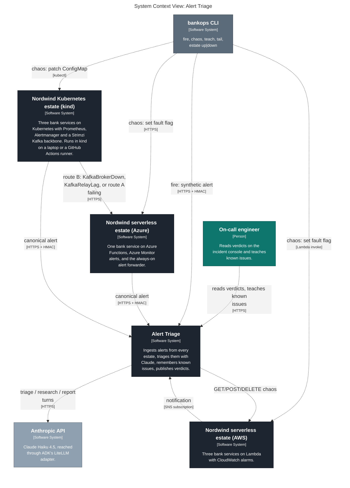
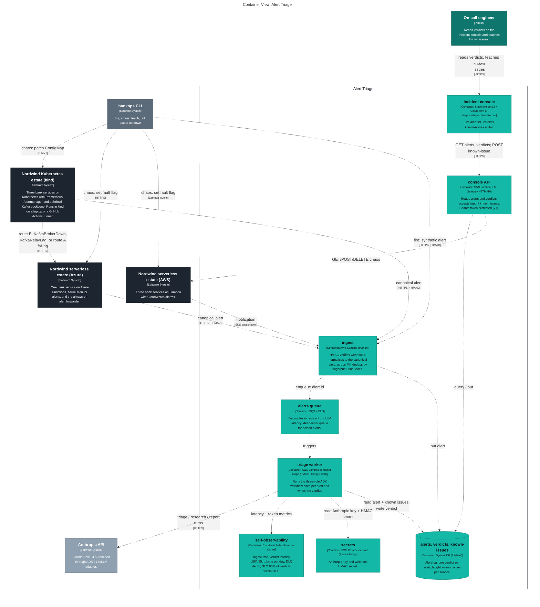
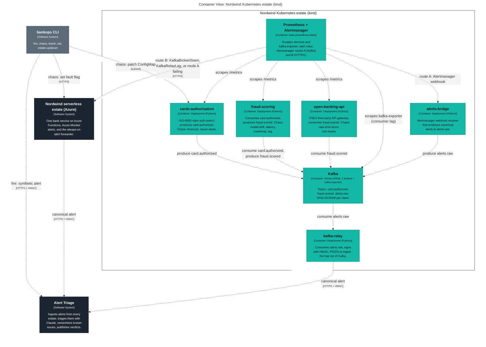
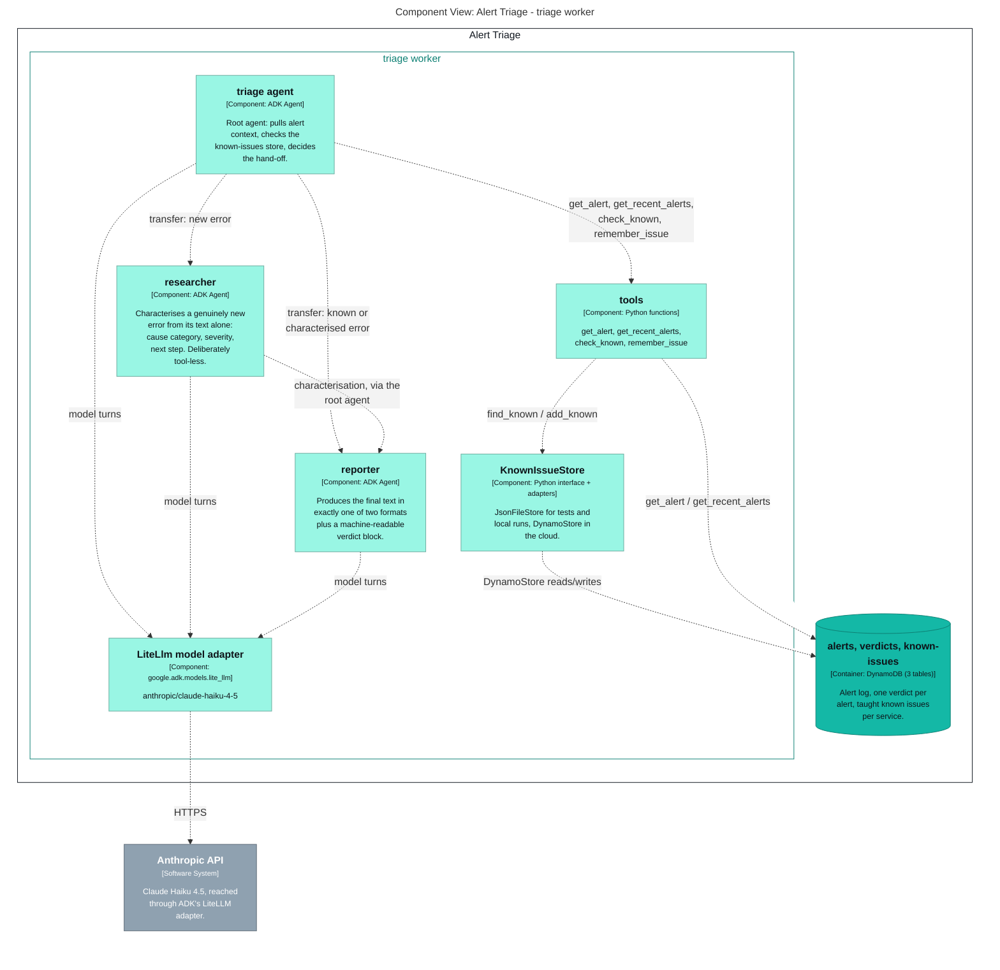

# Generated C4 diagrams

Exported from [`../workspace.dsl`](../workspace.dsl) by `task c4`; do not edit by hand.

## Level 1 — system context



## Level 2 — the triage brain and its inbound sources



## Level 2 — the Kubernetes estate: services, Kafka, Prometheus, both alert routes



## Level 3 — inside the triage worker



## Deployment — where every container runs in `demo`

```mermaid
graph LR
  linkStyle default fill:#ffffff

  subgraph diagram ["Deployment View: demo"]
    style diagram fill:#ffffff,stroke:#ffffff

    subgraph 111 ["GitHub"]
      style 111 fill:#ffffff,stroke:#444444,color:#444444

      subgraph 112 ["Actions runner"]
        style 112 fill:#ffffff,stroke:#444444,color:#444444

        subgraph 113 ["kind cluster"]
          style 113 fill:#ffffff,stroke:#444444,color:#444444

          114["<div style='font-weight: bold'>cards-authorization</div><div style='font-size: 70%; margin-top: 0px'>[Container: Deployment (Python)]</div><div style='font-size: 80%; margin-top:10px'>ISO-8583-style auth switch;<br />produces card.authorized.<br />Chaos: timeouts, issuer-down.</div>"]
          style 114 fill:#14b8a6,stroke:#0e8074,color:#0e1419
          115["<div style='font-weight: bold'>fraud-scoring</div><div style='font-size: 70%; margin-top: 0px'>[Container: Deployment (Python)]</div><div style='font-size: 80%; margin-top:10px'>Consumes card.authorized,<br />produces fraud.scored. Chaos:<br />model-drift, latency,<br />crashloop, lag.</div>"]
          style 115 fill:#14b8a6,stroke:#0e8074,color:#0e1419
          116["<div style='font-weight: bold'>open-banking-api</div><div style='font-size: 70%; margin-top: 0px'>[Container: Deployment (Python)]</div><div style='font-size: 80%; margin-top:10px'>PSD2 third-party API gateway;<br />consumes fraud.scored. Chaos:<br />rate-limit-storm,<br />cert-expiry.</div>"]
          style 116 fill:#14b8a6,stroke:#0e8074,color:#0e1419
          117["<div style='font-weight: bold'>Kafka</div><div style='font-size: 70%; margin-top: 0px'>[Container: Strimzi (KRaft, 1 broker) + kafka-exporter]</div><div style='font-size: 80%; margin-top:10px'>Topics: card.authorized,<br />fraud.scored, alerts.raw.<br />SASL/SCRAM per client.</div>"]
          style 117 fill:#14b8a6,stroke:#0e8074,color:#0e1419
          121["<div style='font-weight: bold'>Prometheus + Alertmanager</div><div style='font-size: 70%; margin-top: 0px'>[Container: kube-prometheus-stack]</div><div style='font-size: 80%; margin-top:10px'>Scrapes services and<br />kafka-exporter; alert rules;<br />Alertmanager routes A (Kafka)<br />and B (HTTPS).</div>"]
          style 121 fill:#14b8a6,stroke:#0e8074,color:#0e1419
          126["<div style='font-weight: bold'>alerts-bridge</div><div style='font-size: 70%; margin-top: 0px'>[Container: Deployment (Python)]</div><div style='font-size: 80%; margin-top:10px'>Alertmanager webhook receiver<br />that produces canonical<br />alerts to alerts.raw.</div>"]
          style 126 fill:#14b8a6,stroke:#0e8074,color:#0e1419
          129["<div style='font-weight: bold'>kafka-relay</div><div style='font-size: 70%; margin-top: 0px'>[Container: Deployment (Python)]</div><div style='font-size: 80%; margin-top:10px'>Consumes alerts.raw, signs<br />with HMAC, POSTs to ingest -<br />the hop out of Kafka.</div>"]
          style 129 fill:#14b8a6,stroke:#0e8074,color:#0e1419
        end

      end

    end

    subgraph 131 ["Laptop"]
      style 131 fill:#ffffff,stroke:#444444,color:#444444

      subgraph 132 ["kind cluster (dev)"]
        style 132 fill:#ffffff,stroke:#444444,color:#444444

        133["<div style='font-weight: bold'>cards-authorization</div><div style='font-size: 70%; margin-top: 0px'>[Container: Deployment (Python)]</div><div style='font-size: 80%; margin-top:10px'>ISO-8583-style auth switch;<br />produces card.authorized.<br />Chaos: timeouts, issuer-down.</div>"]
        style 133 fill:#14b8a6,stroke:#0e8074,color:#0e1419
        136["<div style='font-weight: bold'>fraud-scoring</div><div style='font-size: 70%; margin-top: 0px'>[Container: Deployment (Python)]</div><div style='font-size: 80%; margin-top:10px'>Consumes card.authorized,<br />produces fraud.scored. Chaos:<br />model-drift, latency,<br />crashloop, lag.</div>"]
        style 136 fill:#14b8a6,stroke:#0e8074,color:#0e1419
        139["<div style='font-weight: bold'>open-banking-api</div><div style='font-size: 70%; margin-top: 0px'>[Container: Deployment (Python)]</div><div style='font-size: 80%; margin-top:10px'>PSD2 third-party API gateway;<br />consumes fraud.scored. Chaos:<br />rate-limit-storm,<br />cert-expiry.</div>"]
        style 139 fill:#14b8a6,stroke:#0e8074,color:#0e1419
        142["<div style='font-weight: bold'>Kafka</div><div style='font-size: 70%; margin-top: 0px'>[Container: Strimzi (KRaft, 1 broker) + kafka-exporter]</div><div style='font-size: 80%; margin-top:10px'>Topics: card.authorized,<br />fraud.scored, alerts.raw.<br />SASL/SCRAM per client.</div>"]
        style 142 fill:#14b8a6,stroke:#0e8074,color:#0e1419
        152["<div style='font-weight: bold'>Prometheus + Alertmanager</div><div style='font-size: 70%; margin-top: 0px'>[Container: kube-prometheus-stack]</div><div style='font-size: 80%; margin-top:10px'>Scrapes services and<br />kafka-exporter; alert rules;<br />Alertmanager routes A (Kafka)<br />and B (HTTPS).</div>"]
        style 152 fill:#14b8a6,stroke:#0e8074,color:#0e1419
        162["<div style='font-weight: bold'>alerts-bridge</div><div style='font-size: 70%; margin-top: 0px'>[Container: Deployment (Python)]</div><div style='font-size: 80%; margin-top:10px'>Alertmanager webhook receiver<br />that produces canonical<br />alerts to alerts.raw.</div>"]
        style 162 fill:#14b8a6,stroke:#0e8074,color:#0e1419
        167["<div style='font-weight: bold'>kafka-relay</div><div style='font-size: 70%; margin-top: 0px'>[Container: Deployment (Python)]</div><div style='font-size: 80%; margin-top:10px'>Consumes alerts.raw, signs<br />with HMAC, POSTs to ingest -<br />the hop out of Kafka.</div>"]
        style 167 fill:#14b8a6,stroke:#0e8074,color:#0e1419
      end

    end

    subgraph 170 ["AWS"]
      style 170 fill:#ffffff,stroke:#444444,color:#444444

      subgraph 171 ["Lambda"]
        style 171 fill:#ffffff,stroke:#444444,color:#444444

        172["<div style='font-weight: bold'>ingest</div><div style='font-size: 70%; margin-top: 0px'>[Container: AWS Lambda (Python)]</div><div style='font-size: 80%; margin-top:10px'>HMAC-verifies webhooks,<br />normalises to the canonical<br />alert, scrubs PII, dedups by<br />fingerprint, enqueues.</div>"]
        style 172 fill:#14b8a6,stroke:#0e8074,color:#0e1419
        175["<div style='font-weight: bold'>triage worker</div><div style='font-size: 70%; margin-top: 0px'>[Container: AWS Lambda container image (Python, Google ADK)]</div><div style='font-size: 80%; margin-top:10px'>Runs the three-role ADK<br />workflow once per alert and<br />writes the verdict.</div>"]
        style 175 fill:#14b8a6,stroke:#0e8074,color:#0e1419
        176["<div style='font-weight: bold'>payments</div><div style='font-size: 70%; margin-top: 0px'>[Container: AWS Lambda (Python)]</div><div style='font-size: 80%; margin-top:10px'>Card payment authorisation<br />API. Chaos: errors, latency,<br />pool.</div>"]
        style 176 fill:#14b8a6,stroke:#0e8074,color:#0e1419
        177["<div style='font-weight: bold'>ledger</div><div style='font-size: 70%; margin-top: 0px'>[Container: AWS Lambda (Python)]</div><div style='font-size: 80%; margin-top:10px'>Double-entry posting worker<br />fed by SQS. Chaos:<br />reconciliation-mismatch, lag.</div>"]
        style 177 fill:#14b8a6,stroke:#0e8074,color:#0e1419
        178["<div style='font-weight: bold'>auth</div><div style='font-size: 70%; margin-top: 0px'>[Container: AWS Lambda (Python)]</div><div style='font-size: 80%; margin-top:10px'>Token issuance / JWKS. Chaos:<br />jwks-rotation, lockouts.</div>"]
        style 178 fill:#14b8a6,stroke:#0e8074,color:#0e1419
      end

      subgraph 179 ["API Gateway"]
        style 179 fill:#ffffff,stroke:#444444,color:#444444

        180["<div style='font-weight: bold'>console API</div><div style='font-size: 70%; margin-top: 0px'>[Container: AWS Lambda + API Gateway HTTP API]</div><div style='font-size: 80%; margin-top:10px'>Reads alerts and verdicts;<br />accepts taught known issues.<br />Bearer-token protected (v1).</div>"]
        style 180 fill:#14b8a6,stroke:#0e8074,color:#0e1419
      end

      subgraph 181 ["SQS"]
        style 181 fill:#ffffff,stroke:#444444,color:#444444

        182["<div style='font-weight: bold'>alerts queue</div><div style='font-size: 70%; margin-top: 0px'>[Container: SQS + DLQ]</div><div style='font-size: 80%; margin-top:10px'>Decouples ingestion from LLM<br />latency; dead-letter queue<br />for poison alerts.</div>"]
        style 182 fill:#14b8a6,stroke:#0e8074,color:#0e1419
        185["<div style='font-weight: bold'>ledger queue</div><div style='font-size: 70%; margin-top: 0px'>[Container: SQS + DLQ]</div><div style='font-size: 80%; margin-top:10px'>Decouples payments from<br />ledger posting; DLQ after 5<br />failed attempts.</div>"]
        style 185 fill:#14b8a6,stroke:#0e8074,color:#0e1419
      end

      subgraph 188 ["SNS"]
        style 188 fill:#ffffff,stroke:#444444,color:#444444

        189["<div style='font-weight: bold'>alarm topic</div><div style='font-size: 70%; margin-top: 0px'>[Container: SNS]</div><div style='font-size: 80%; margin-top:10px'>CloudWatch alarm state<br />changes fan out here.</div>"]
        style 189 fill:#14b8a6,stroke:#0e8074,color:#0e1419
      end

      subgraph 194 ["DynamoDB"]
        style 194 fill:#ffffff,stroke:#444444,color:#444444

        195[("<div style='font-weight: bold'>alerts, verdicts, known-issues</div><div style='font-size: 70%; margin-top: 0px'>[Container: DynamoDB (3 tables)]</div><div style='font-size: 80%; margin-top:10px'>Alert log, one verdict per<br />alert, taught known issues<br />per service.</div>")]
        style 195 fill:#14b8a6,stroke:#0e8074,color:#0e1419
        199[("<div style='font-weight: bold'>faults</div><div style='font-size: 70%; margin-top: 0px'>[Container: DynamoDB]</div><div style='font-size: 80%; margin-top:10px'>One fault flag per service,<br />set by bankops chaos or the<br />console API.</div>")]
        style 199 fill:#14b8a6,stroke:#0e8074,color:#0e1419
      end

      subgraph 204 ["CloudFront + S3"]
        style 204 fill:#ffffff,stroke:#444444,color:#444444

        205["<div style='font-weight: bold'>incident console</div><div style='font-size: 70%; margin-top: 0px'>[Container: Static site on S3 + CloudFront at triage.serhiykucherenko.dev]</div><div style='font-size: 80%; margin-top:10px'>Live alert list, verdicts,<br />known-issues editor.</div>"]
        style 205 fill:#14b8a6,stroke:#0e8074,color:#0e1419
      end

      subgraph 207 ["SSM"]
        style 207 fill:#ffffff,stroke:#444444,color:#444444

        208["<div style='font-weight: bold'>secrets</div><div style='font-size: 70%; margin-top: 0px'>[Container: SSM Parameter Store (SecureString)]</div><div style='font-size: 80%; margin-top:10px'>Anthropic key and webhook<br />HMAC secret.</div>"]
        style 208 fill:#14b8a6,stroke:#0e8074,color:#0e1419
      end

      subgraph 210 ["CloudWatch"]
        style 210 fill:#ffffff,stroke:#444444,color:#444444

        211["<div style='font-weight: bold'>self-observability</div><div style='font-size: 70%; margin-top: 0px'>[Container: CloudWatch dashboard + alarms]</div><div style='font-size: 80%; margin-top:10px'>Ingest rate, verdict latency<br />p50/p95, tokens per day, DLQ<br />depth; SLO 95% of verdicts<br />within 90 s.</div>"]
        style 211 fill:#14b8a6,stroke:#0e8074,color:#0e1419
      end

      subgraph 213 ["ECR"]
        style 213 fill:#ffffff,stroke:#444444,color:#444444

        214["<div style='font-weight: bold'>triage-worker image</div><div style='font-size: 70%; margin-top: 0px'>[Infrastructure Node]</div><div style='font-size: 80%; margin-top:10px'>Immutable image tagged by git<br />SHA (also `:latest`); built<br />and pushed by deploy.yml's<br />`image` job, run by the<br />Lambda above.</div>"]
        style 214 fill:#ffffff,stroke:#444444,color:#444444
      end

    end

    subgraph 215 ["Azure"]
      style 215 fill:#ffffff,stroke:#444444,color:#444444

      subgraph 216 ["Function App (consumption)"]
        style 216 fill:#ffffff,stroke:#444444,color:#444444

        217["<div style='font-weight: bold'>customer-notifications</div><div style='font-size: 70%; margin-top: 0px'>[Container: Azure Function (Python)]</div><div style='font-size: 80%; margin-top:10px'>SMS / e-mail fan-out. Chaos:<br />provider-429, backlog.</div>"]
        style 217 fill:#14b8a6,stroke:#0e8074,color:#0e1419
        218["<div style='font-weight: bold'>alert forwarder</div><div style='font-size: 70%; margin-top: 0px'>[Container: Azure Function (Python)]</div><div style='font-size: 80%; margin-top:10px'>Receives Azure Monitor<br />action-group calls and<br />Alertmanager route-B<br />webhooks, signs with HMAC,<br />posts to ingest.</div>"]
        style 218 fill:#14b8a6,stroke:#0e8074,color:#0e1419
      end

      subgraph 222 ["Azure Monitor"]
        style 222 fill:#ffffff,stroke:#444444,color:#444444

        223["<div style='font-weight: bold'>Azure Monitor</div><div style='font-size: 70%; margin-top: 0px'>[Container: Azure Monitor]</div><div style='font-size: 80%; margin-top:10px'>Metric alert rules + action<br />group.</div>"]
        style 223 fill:#14b8a6,stroke:#0e8074,color:#0e1419
      end

    end

    subgraph 226 ["Anthropic"]
      style 226 fill:#ffffff,stroke:#444444,color:#444444

      227["<div style='font-weight: bold'>Anthropic API</div><div style='font-size: 70%; margin-top: 0px'>[Software System]</div><div style='font-size: 80%; margin-top:10px'>Claude Haiku 4.5, reached<br />through ADK's LiteLLM<br />adapter.</div>"]
      style 227 fill:#8fa1b0,stroke:#64707b,color:#ffffff
    end

    subgraph 229 ["Cloudflare"]
      style 229 fill:#ffffff,stroke:#444444,color:#444444

      230["<div style='font-weight: bold'>NS delegation</div><div style='font-size: 70%; margin-top: 0px'>[Infrastructure Node]</div>"]
      style 230 fill:#ffffff,stroke:#444444,color:#444444
    end

    114-. "<div>produce card.authorized</div><div style='font-size: 70%'></div>" .->117
    115-. "<div>consume card.authorized,<br />produce fraud.scored</div><div style='font-size: 70%'></div>" .->117
    116-. "<div>consume fraud.scored</div><div style='font-size: 70%'></div>" .->117
    121-. "<div>scrapes /metrics</div><div style='font-size: 70%'></div>" .->114
    121-. "<div>scrapes /metrics</div><div style='font-size: 70%'></div>" .->115
    121-. "<div>scrapes /metrics</div><div style='font-size: 70%'></div>" .->116
    121-. "<div>scrapes kafka-exporter<br />(consumer lag)</div><div style='font-size: 70%'></div>" .->117
    126-. "<div>produce alerts.raw</div><div style='font-size: 70%'></div>" .->117
    121-. "<div>route A: Alertmanager webhook</div><div style='font-size: 70%'></div>" .->126
    117-. "<div>consume alerts.raw</div><div style='font-size: 70%'></div>" .->129
    133-. "<div>produce card.authorized</div><div style='font-size: 70%'></div>" .->117
    121-. "<div>scrapes /metrics</div><div style='font-size: 70%'></div>" .->133
    136-. "<div>consume card.authorized,<br />produce fraud.scored</div><div style='font-size: 70%'></div>" .->117
    121-. "<div>scrapes /metrics</div><div style='font-size: 70%'></div>" .->136
    139-. "<div>consume fraud.scored</div><div style='font-size: 70%'></div>" .->117
    121-. "<div>scrapes /metrics</div><div style='font-size: 70%'></div>" .->139
    114-. "<div>produce card.authorized</div><div style='font-size: 70%'></div>" .->142
    115-. "<div>consume card.authorized,<br />produce fraud.scored</div><div style='font-size: 70%'></div>" .->142
    116-. "<div>consume fraud.scored</div><div style='font-size: 70%'></div>" .->142
    121-. "<div>scrapes kafka-exporter<br />(consumer lag)</div><div style='font-size: 70%'></div>" .->142
    126-. "<div>produce alerts.raw</div><div style='font-size: 70%'></div>" .->142
    142-. "<div>consume alerts.raw</div><div style='font-size: 70%'></div>" .->129
    133-. "<div>produce card.authorized</div><div style='font-size: 70%'></div>" .->142
    136-. "<div>consume card.authorized,<br />produce fraud.scored</div><div style='font-size: 70%'></div>" .->142
    139-. "<div>consume fraud.scored</div><div style='font-size: 70%'></div>" .->142
    152-. "<div>scrapes /metrics</div><div style='font-size: 70%'></div>" .->114
    152-. "<div>scrapes /metrics</div><div style='font-size: 70%'></div>" .->115
    152-. "<div>scrapes /metrics</div><div style='font-size: 70%'></div>" .->116
    152-. "<div>scrapes kafka-exporter<br />(consumer lag)</div><div style='font-size: 70%'></div>" .->117
    152-. "<div>route A: Alertmanager webhook</div><div style='font-size: 70%'></div>" .->126
    152-. "<div>scrapes /metrics</div><div style='font-size: 70%'></div>" .->133
    152-. "<div>scrapes /metrics</div><div style='font-size: 70%'></div>" .->136
    152-. "<div>scrapes /metrics</div><div style='font-size: 70%'></div>" .->139
    152-. "<div>scrapes kafka-exporter<br />(consumer lag)</div><div style='font-size: 70%'></div>" .->142
    162-. "<div>produce alerts.raw</div><div style='font-size: 70%'></div>" .->117
    121-. "<div>route A: Alertmanager webhook</div><div style='font-size: 70%'></div>" .->162
    162-. "<div>produce alerts.raw</div><div style='font-size: 70%'></div>" .->142
    152-. "<div>route A: Alertmanager webhook</div><div style='font-size: 70%'></div>" .->162
    117-. "<div>consume alerts.raw</div><div style='font-size: 70%'></div>" .->167
    142-. "<div>consume alerts.raw</div><div style='font-size: 70%'></div>" .->167
    129-. "<div>canonical alert</div><div style='font-size: 70%'>[HTTPS + HMAC]</div>" .->172
    167-. "<div>canonical alert</div><div style='font-size: 70%'>[HTTPS + HMAC]</div>" .->172
    172-. "<div>enqueue alert id</div><div style='font-size: 70%'></div>" .->182
    182-. "<div>triggers</div><div style='font-size: 70%'></div>" .->175
    176-. "<div>enqueue authorisation</div><div style='font-size: 70%'></div>" .->185
    185-. "<div>triggers</div><div style='font-size: 70%'></div>" .->177
    189-. "<div>notification</div><div style='font-size: 70%'>[SNS subscription]</div>" .->172
    176-. "<div>alarm state change</div><div style='font-size: 70%'></div>" .->189
    177-. "<div>alarm state change</div><div style='font-size: 70%'></div>" .->189
    178-. "<div>alarm state change</div><div style='font-size: 70%'></div>" .->189
    172-. "<div>put alert</div><div style='font-size: 70%'></div>" .->195
    175-. "<div>read alert + known issues,<br />write verdict</div><div style='font-size: 70%'></div>" .->195
    180-. "<div>query / put</div><div style='font-size: 70%'></div>" .->195
    176-. "<div>read fault flag</div><div style='font-size: 70%'></div>" .->199
    177-. "<div>read fault flag</div><div style='font-size: 70%'></div>" .->199
    178-. "<div>read fault flag</div><div style='font-size: 70%'></div>" .->199
    180-. "<div>GET/POST/DELETE chaos</div><div style='font-size: 70%'></div>" .->199
    205-. "<div>GET alerts, verdicts; POST<br />known-issue</div><div style='font-size: 70%'>[HTTPS]</div>" .->180
    175-. "<div>read Anthropic key + HMAC<br />secret</div><div style='font-size: 70%'></div>" .->208
    175-. "<div>latency + token metrics</div><div style='font-size: 70%'></div>" .->211
    121-. "<div>route B: KafkaBrokerDown,<br />KafkaRelayLag, or route A<br />failing</div><div style='font-size: 70%'>[HTTPS]</div>" .->218
    152-. "<div>route B: KafkaBrokerDown,<br />KafkaRelayLag, or route A<br />failing</div><div style='font-size: 70%'>[HTTPS]</div>" .->218
    218-. "<div>canonical alert</div><div style='font-size: 70%'>[HTTPS + HMAC]</div>" .->172
    217-. "<div>telemetry</div><div style='font-size: 70%'></div>" .->223
    223-. "<div>action group webhook</div><div style='font-size: 70%'>[HTTPS]</div>" .->218
    175-. "<div>triage / research / report<br />turns</div><div style='font-size: 70%'>[HTTPS]</div>" .->227

  end
```
