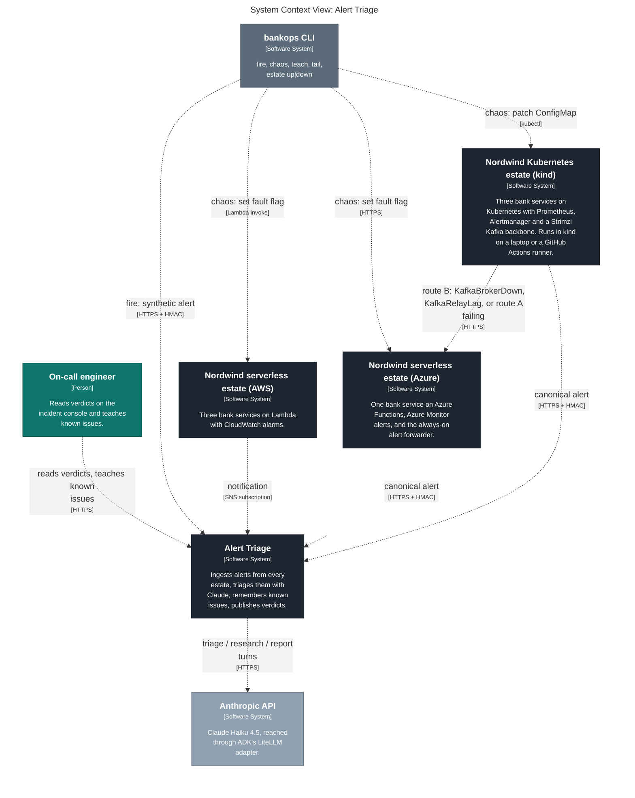
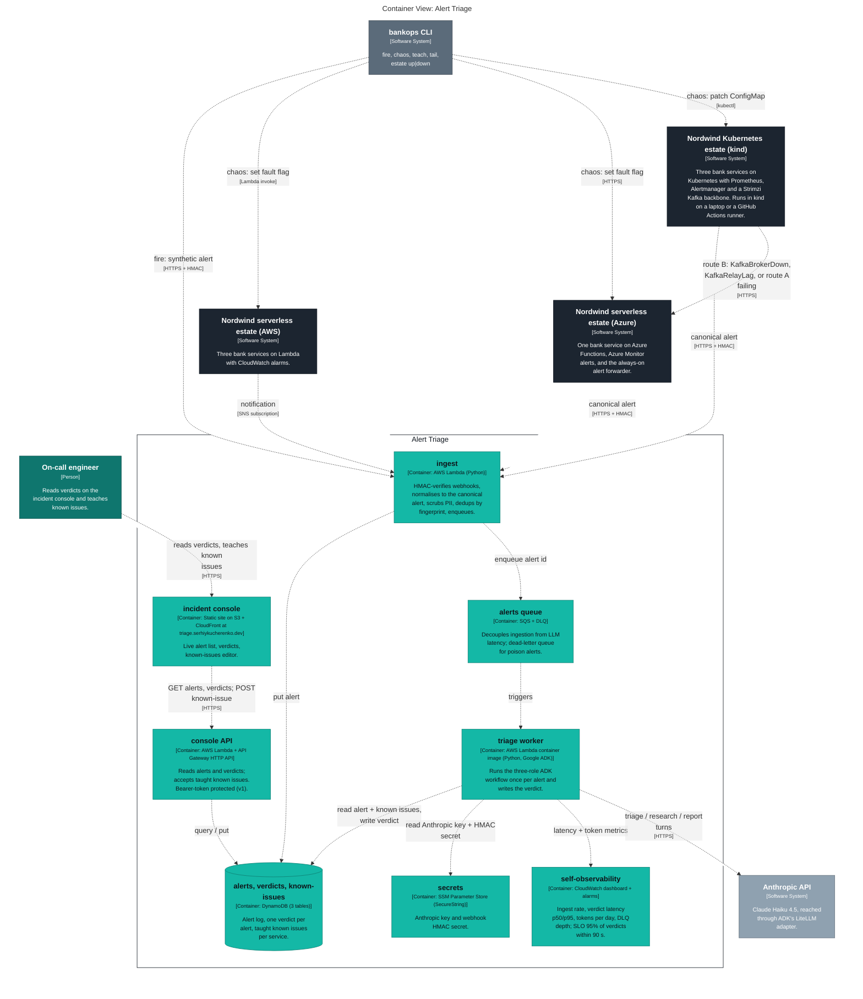
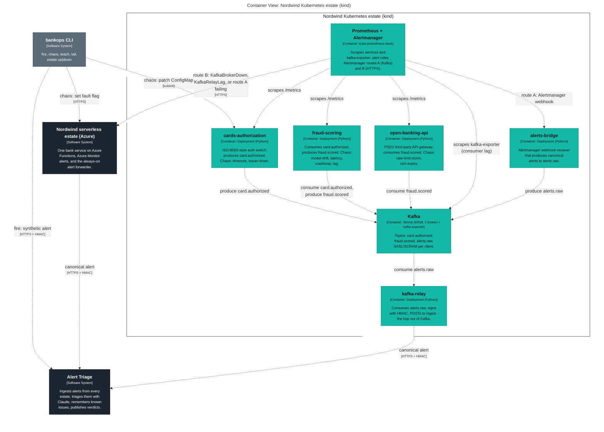
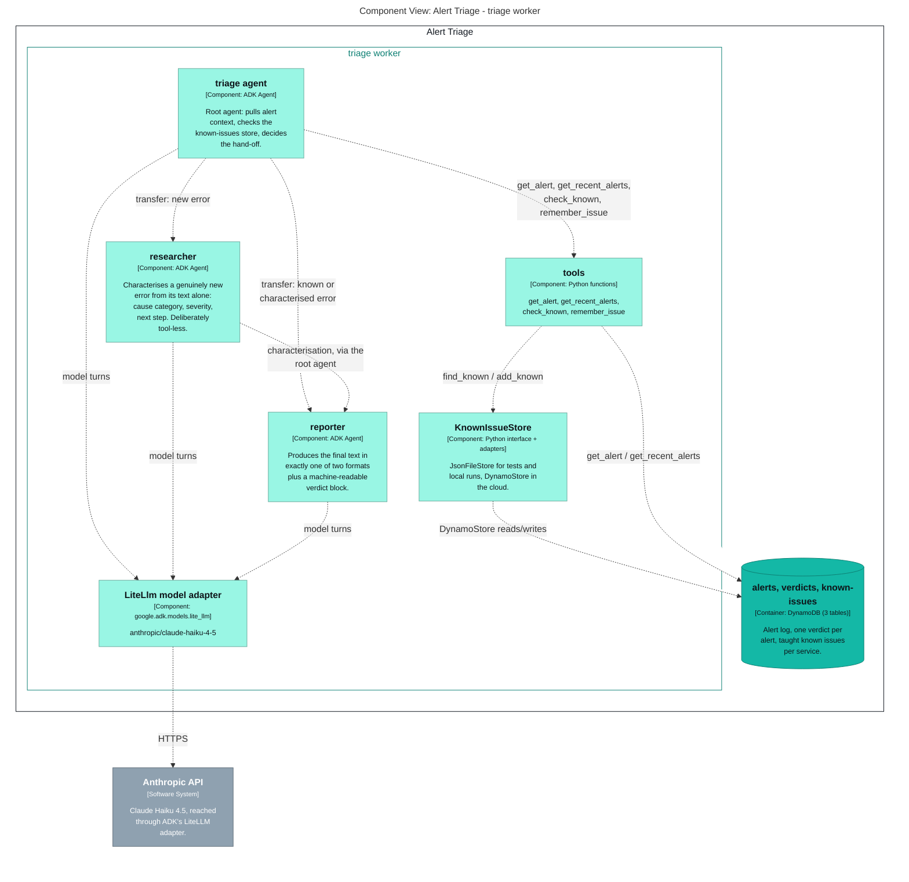

# Generated C4 diagrams

Exported from [`../workspace.dsl`](../workspace.dsl) by `task c4`; do not edit by hand.

## Level 1 — system context



## Level 2 — the triage brain and its inbound sources



## Level 2 — the Kubernetes estate: services, Kafka, Prometheus, both alert routes



## Level 3 — inside the triage worker



## Deployment — where every container runs in `demo`

```mermaid
graph LR
  linkStyle default fill:#ffffff

  subgraph diagram ["Deployment View: demo"]
    style diagram fill:#ffffff,stroke:#ffffff

    subgraph 100 ["GitHub"]
      style 100 fill:#ffffff,stroke:#444444,color:#444444

      subgraph 101 ["Actions runner"]
        style 101 fill:#ffffff,stroke:#444444,color:#444444

        subgraph 102 ["kind cluster"]
          style 102 fill:#ffffff,stroke:#444444,color:#444444

          103["<div style='font-weight: bold'>cards-authorization</div><div style='font-size: 70%; margin-top: 0px'>[Container: Deployment (Python)]</div><div style='font-size: 80%; margin-top:10px'>ISO-8583-style auth switch;<br />produces card.authorized.<br />Chaos: timeouts, issuer-down.</div>"]
          style 103 fill:#14b8a6,stroke:#0e8074,color:#0e1419
          104["<div style='font-weight: bold'>fraud-scoring</div><div style='font-size: 70%; margin-top: 0px'>[Container: Deployment (Python)]</div><div style='font-size: 80%; margin-top:10px'>Consumes card.authorized,<br />produces fraud.scored. Chaos:<br />model-drift, latency,<br />crashloop, lag.</div>"]
          style 104 fill:#14b8a6,stroke:#0e8074,color:#0e1419
          105["<div style='font-weight: bold'>open-banking-api</div><div style='font-size: 70%; margin-top: 0px'>[Container: Deployment (Python)]</div><div style='font-size: 80%; margin-top:10px'>PSD2 third-party API gateway;<br />consumes fraud.scored. Chaos:<br />rate-limit-storm,<br />cert-expiry.</div>"]
          style 105 fill:#14b8a6,stroke:#0e8074,color:#0e1419
          106["<div style='font-weight: bold'>Kafka</div><div style='font-size: 70%; margin-top: 0px'>[Container: Strimzi (KRaft, 1 broker) + kafka-exporter]</div><div style='font-size: 80%; margin-top:10px'>Topics: card.authorized,<br />fraud.scored, alerts.raw.<br />SASL/SCRAM per client.</div>"]
          style 106 fill:#14b8a6,stroke:#0e8074,color:#0e1419
          110["<div style='font-weight: bold'>Prometheus + Alertmanager</div><div style='font-size: 70%; margin-top: 0px'>[Container: kube-prometheus-stack]</div><div style='font-size: 80%; margin-top:10px'>Scrapes services and<br />kafka-exporter; alert rules;<br />Alertmanager routes A (Kafka)<br />and B (HTTPS).</div>"]
          style 110 fill:#14b8a6,stroke:#0e8074,color:#0e1419
          115["<div style='font-weight: bold'>alerts-bridge</div><div style='font-size: 70%; margin-top: 0px'>[Container: Deployment (Python)]</div><div style='font-size: 80%; margin-top:10px'>Alertmanager webhook receiver<br />that produces canonical<br />alerts to alerts.raw.</div>"]
          style 115 fill:#14b8a6,stroke:#0e8074,color:#0e1419
          118["<div style='font-weight: bold'>kafka-relay</div><div style='font-size: 70%; margin-top: 0px'>[Container: Deployment (Python)]</div><div style='font-size: 80%; margin-top:10px'>Consumes alerts.raw, signs<br />with HMAC, POSTs to ingest -<br />the hop out of Kafka.</div>"]
          style 118 fill:#14b8a6,stroke:#0e8074,color:#0e1419
        end

      end

    end

    subgraph 120 ["Laptop"]
      style 120 fill:#ffffff,stroke:#444444,color:#444444

      subgraph 121 ["kind cluster (dev)"]
        style 121 fill:#ffffff,stroke:#444444,color:#444444

        122["<div style='font-weight: bold'>cards-authorization</div><div style='font-size: 70%; margin-top: 0px'>[Container: Deployment (Python)]</div><div style='font-size: 80%; margin-top:10px'>ISO-8583-style auth switch;<br />produces card.authorized.<br />Chaos: timeouts, issuer-down.</div>"]
        style 122 fill:#14b8a6,stroke:#0e8074,color:#0e1419
        125["<div style='font-weight: bold'>fraud-scoring</div><div style='font-size: 70%; margin-top: 0px'>[Container: Deployment (Python)]</div><div style='font-size: 80%; margin-top:10px'>Consumes card.authorized,<br />produces fraud.scored. Chaos:<br />model-drift, latency,<br />crashloop, lag.</div>"]
        style 125 fill:#14b8a6,stroke:#0e8074,color:#0e1419
        128["<div style='font-weight: bold'>open-banking-api</div><div style='font-size: 70%; margin-top: 0px'>[Container: Deployment (Python)]</div><div style='font-size: 80%; margin-top:10px'>PSD2 third-party API gateway;<br />consumes fraud.scored. Chaos:<br />rate-limit-storm,<br />cert-expiry.</div>"]
        style 128 fill:#14b8a6,stroke:#0e8074,color:#0e1419
        131["<div style='font-weight: bold'>Kafka</div><div style='font-size: 70%; margin-top: 0px'>[Container: Strimzi (KRaft, 1 broker) + kafka-exporter]</div><div style='font-size: 80%; margin-top:10px'>Topics: card.authorized,<br />fraud.scored, alerts.raw.<br />SASL/SCRAM per client.</div>"]
        style 131 fill:#14b8a6,stroke:#0e8074,color:#0e1419
        141["<div style='font-weight: bold'>Prometheus + Alertmanager</div><div style='font-size: 70%; margin-top: 0px'>[Container: kube-prometheus-stack]</div><div style='font-size: 80%; margin-top:10px'>Scrapes services and<br />kafka-exporter; alert rules;<br />Alertmanager routes A (Kafka)<br />and B (HTTPS).</div>"]
        style 141 fill:#14b8a6,stroke:#0e8074,color:#0e1419
        151["<div style='font-weight: bold'>alerts-bridge</div><div style='font-size: 70%; margin-top: 0px'>[Container: Deployment (Python)]</div><div style='font-size: 80%; margin-top:10px'>Alertmanager webhook receiver<br />that produces canonical<br />alerts to alerts.raw.</div>"]
        style 151 fill:#14b8a6,stroke:#0e8074,color:#0e1419
        156["<div style='font-weight: bold'>kafka-relay</div><div style='font-size: 70%; margin-top: 0px'>[Container: Deployment (Python)]</div><div style='font-size: 80%; margin-top:10px'>Consumes alerts.raw, signs<br />with HMAC, POSTs to ingest -<br />the hop out of Kafka.</div>"]
        style 156 fill:#14b8a6,stroke:#0e8074,color:#0e1419
      end

    end

    subgraph 159 ["AWS"]
      style 159 fill:#ffffff,stroke:#444444,color:#444444

      subgraph 160 ["Lambda"]
        style 160 fill:#ffffff,stroke:#444444,color:#444444

        161["<div style='font-weight: bold'>ingest</div><div style='font-size: 70%; margin-top: 0px'>[Container: AWS Lambda (Python)]</div><div style='font-size: 80%; margin-top:10px'>HMAC-verifies webhooks,<br />normalises to the canonical<br />alert, scrubs PII, dedups by<br />fingerprint, enqueues.</div>"]
        style 161 fill:#14b8a6,stroke:#0e8074,color:#0e1419
        164["<div style='font-weight: bold'>triage worker</div><div style='font-size: 70%; margin-top: 0px'>[Container: AWS Lambda container image (Python, Google ADK)]</div><div style='font-size: 80%; margin-top:10px'>Runs the three-role ADK<br />workflow once per alert and<br />writes the verdict.</div>"]
        style 164 fill:#14b8a6,stroke:#0e8074,color:#0e1419
        165["<div style='font-weight: bold'>payments</div><div style='font-size: 70%; margin-top: 0px'>[Container: AWS Lambda (Python)]</div><div style='font-size: 80%; margin-top:10px'>Card payment authorisation<br />API. Chaos: errors, latency,<br />pool.</div>"]
        style 165 fill:#14b8a6,stroke:#0e8074,color:#0e1419
        166["<div style='font-weight: bold'>ledger</div><div style='font-size: 70%; margin-top: 0px'>[Container: AWS Lambda (Python)]</div><div style='font-size: 80%; margin-top:10px'>Double-entry posting worker<br />fed by SQS. Chaos:<br />reconciliation-mismatch, lag.</div>"]
        style 166 fill:#14b8a6,stroke:#0e8074,color:#0e1419
        167["<div style='font-weight: bold'>auth</div><div style='font-size: 70%; margin-top: 0px'>[Container: AWS Lambda (Python)]</div><div style='font-size: 80%; margin-top:10px'>Token issuance / JWKS. Chaos:<br />jwks-rotation, lockouts.</div>"]
        style 167 fill:#14b8a6,stroke:#0e8074,color:#0e1419
      end

      subgraph 168 ["API Gateway"]
        style 168 fill:#ffffff,stroke:#444444,color:#444444

        169["<div style='font-weight: bold'>console API</div><div style='font-size: 70%; margin-top: 0px'>[Container: AWS Lambda + API Gateway HTTP API]</div><div style='font-size: 80%; margin-top:10px'>Reads alerts and verdicts;<br />accepts taught known issues.<br />Bearer-token protected (v1).</div>"]
        style 169 fill:#14b8a6,stroke:#0e8074,color:#0e1419
      end

      subgraph 170 ["SQS"]
        style 170 fill:#ffffff,stroke:#444444,color:#444444

        171["<div style='font-weight: bold'>alerts queue</div><div style='font-size: 70%; margin-top: 0px'>[Container: SQS + DLQ]</div><div style='font-size: 80%; margin-top:10px'>Decouples ingestion from LLM<br />latency; dead-letter queue<br />for poison alerts.</div>"]
        style 171 fill:#14b8a6,stroke:#0e8074,color:#0e1419
      end

      subgraph 174 ["SNS"]
        style 174 fill:#ffffff,stroke:#444444,color:#444444

        175["<div style='font-weight: bold'>alarm topic</div><div style='font-size: 70%; margin-top: 0px'>[Container: SNS]</div><div style='font-size: 80%; margin-top:10px'>CloudWatch alarm state<br />changes fan out here.</div>"]
        style 175 fill:#14b8a6,stroke:#0e8074,color:#0e1419
      end

      subgraph 180 ["DynamoDB"]
        style 180 fill:#ffffff,stroke:#444444,color:#444444

        181[("<div style='font-weight: bold'>alerts, verdicts, known-issues</div><div style='font-size: 70%; margin-top: 0px'>[Container: DynamoDB (3 tables)]</div><div style='font-size: 80%; margin-top:10px'>Alert log, one verdict per<br />alert, taught known issues<br />per service.</div>")]
        style 181 fill:#14b8a6,stroke:#0e8074,color:#0e1419
      end

      subgraph 185 ["CloudFront + S3"]
        style 185 fill:#ffffff,stroke:#444444,color:#444444

        186["<div style='font-weight: bold'>incident console</div><div style='font-size: 70%; margin-top: 0px'>[Container: Static site on S3 + CloudFront at triage.serhiykucherenko.dev]</div><div style='font-size: 80%; margin-top:10px'>Live alert list, verdicts,<br />known-issues editor.</div>"]
        style 186 fill:#14b8a6,stroke:#0e8074,color:#0e1419
      end

      subgraph 188 ["SSM"]
        style 188 fill:#ffffff,stroke:#444444,color:#444444

        189["<div style='font-weight: bold'>secrets</div><div style='font-size: 70%; margin-top: 0px'>[Container: SSM Parameter Store (SecureString)]</div><div style='font-size: 80%; margin-top:10px'>Anthropic key and webhook<br />HMAC secret.</div>"]
        style 189 fill:#14b8a6,stroke:#0e8074,color:#0e1419
      end

      subgraph 191 ["CloudWatch"]
        style 191 fill:#ffffff,stroke:#444444,color:#444444

        192["<div style='font-weight: bold'>self-observability</div><div style='font-size: 70%; margin-top: 0px'>[Container: CloudWatch dashboard + alarms]</div><div style='font-size: 80%; margin-top:10px'>Ingest rate, verdict latency<br />p50/p95, tokens per day, DLQ<br />depth; SLO 95% of verdicts<br />within 90 s.</div>"]
        style 192 fill:#14b8a6,stroke:#0e8074,color:#0e1419
      end

    end

    subgraph 194 ["Azure"]
      style 194 fill:#ffffff,stroke:#444444,color:#444444

      subgraph 195 ["Function App (consumption)"]
        style 195 fill:#ffffff,stroke:#444444,color:#444444

        196["<div style='font-weight: bold'>customer-notifications</div><div style='font-size: 70%; margin-top: 0px'>[Container: Azure Function (Python)]</div><div style='font-size: 80%; margin-top:10px'>SMS / e-mail fan-out. Chaos:<br />provider-429, backlog.</div>"]
        style 196 fill:#14b8a6,stroke:#0e8074,color:#0e1419
        197["<div style='font-weight: bold'>alert forwarder</div><div style='font-size: 70%; margin-top: 0px'>[Container: Azure Function (Python)]</div><div style='font-size: 80%; margin-top:10px'>Receives Azure Monitor<br />action-group calls and<br />Alertmanager route-B<br />webhooks, signs with HMAC,<br />posts to ingest.</div>"]
        style 197 fill:#14b8a6,stroke:#0e8074,color:#0e1419
      end

      subgraph 201 ["Azure Monitor"]
        style 201 fill:#ffffff,stroke:#444444,color:#444444

        202["<div style='font-weight: bold'>Azure Monitor</div><div style='font-size: 70%; margin-top: 0px'>[Container: Azure Monitor]</div><div style='font-size: 80%; margin-top:10px'>Metric alert rules + action<br />group.</div>"]
        style 202 fill:#14b8a6,stroke:#0e8074,color:#0e1419
      end

    end

    subgraph 205 ["Anthropic"]
      style 205 fill:#ffffff,stroke:#444444,color:#444444

      206["<div style='font-weight: bold'>Anthropic API</div><div style='font-size: 70%; margin-top: 0px'>[Software System]</div><div style='font-size: 80%; margin-top:10px'>Claude Haiku 4.5, reached<br />through ADK's LiteLLM<br />adapter.</div>"]
      style 206 fill:#8fa1b0,stroke:#64707b,color:#ffffff
    end

    103-. "<div>produce card.authorized</div><div style='font-size: 70%'></div>" .->106
    104-. "<div>consume card.authorized,<br />produce fraud.scored</div><div style='font-size: 70%'></div>" .->106
    105-. "<div>consume fraud.scored</div><div style='font-size: 70%'></div>" .->106
    110-. "<div>scrapes /metrics</div><div style='font-size: 70%'></div>" .->103
    110-. "<div>scrapes /metrics</div><div style='font-size: 70%'></div>" .->104
    110-. "<div>scrapes /metrics</div><div style='font-size: 70%'></div>" .->105
    110-. "<div>scrapes kafka-exporter<br />(consumer lag)</div><div style='font-size: 70%'></div>" .->106
    115-. "<div>produce alerts.raw</div><div style='font-size: 70%'></div>" .->106
    110-. "<div>route A: Alertmanager webhook</div><div style='font-size: 70%'></div>" .->115
    106-. "<div>consume alerts.raw</div><div style='font-size: 70%'></div>" .->118
    122-. "<div>produce card.authorized</div><div style='font-size: 70%'></div>" .->106
    110-. "<div>scrapes /metrics</div><div style='font-size: 70%'></div>" .->122
    125-. "<div>consume card.authorized,<br />produce fraud.scored</div><div style='font-size: 70%'></div>" .->106
    110-. "<div>scrapes /metrics</div><div style='font-size: 70%'></div>" .->125
    128-. "<div>consume fraud.scored</div><div style='font-size: 70%'></div>" .->106
    110-. "<div>scrapes /metrics</div><div style='font-size: 70%'></div>" .->128
    103-. "<div>produce card.authorized</div><div style='font-size: 70%'></div>" .->131
    104-. "<div>consume card.authorized,<br />produce fraud.scored</div><div style='font-size: 70%'></div>" .->131
    105-. "<div>consume fraud.scored</div><div style='font-size: 70%'></div>" .->131
    110-. "<div>scrapes kafka-exporter<br />(consumer lag)</div><div style='font-size: 70%'></div>" .->131
    115-. "<div>produce alerts.raw</div><div style='font-size: 70%'></div>" .->131
    131-. "<div>consume alerts.raw</div><div style='font-size: 70%'></div>" .->118
    122-. "<div>produce card.authorized</div><div style='font-size: 70%'></div>" .->131
    125-. "<div>consume card.authorized,<br />produce fraud.scored</div><div style='font-size: 70%'></div>" .->131
    128-. "<div>consume fraud.scored</div><div style='font-size: 70%'></div>" .->131
    141-. "<div>scrapes /metrics</div><div style='font-size: 70%'></div>" .->103
    141-. "<div>scrapes /metrics</div><div style='font-size: 70%'></div>" .->104
    141-. "<div>scrapes /metrics</div><div style='font-size: 70%'></div>" .->105
    141-. "<div>scrapes kafka-exporter<br />(consumer lag)</div><div style='font-size: 70%'></div>" .->106
    141-. "<div>route A: Alertmanager webhook</div><div style='font-size: 70%'></div>" .->115
    141-. "<div>scrapes /metrics</div><div style='font-size: 70%'></div>" .->122
    141-. "<div>scrapes /metrics</div><div style='font-size: 70%'></div>" .->125
    141-. "<div>scrapes /metrics</div><div style='font-size: 70%'></div>" .->128
    141-. "<div>scrapes kafka-exporter<br />(consumer lag)</div><div style='font-size: 70%'></div>" .->131
    151-. "<div>produce alerts.raw</div><div style='font-size: 70%'></div>" .->106
    110-. "<div>route A: Alertmanager webhook</div><div style='font-size: 70%'></div>" .->151
    151-. "<div>produce alerts.raw</div><div style='font-size: 70%'></div>" .->131
    141-. "<div>route A: Alertmanager webhook</div><div style='font-size: 70%'></div>" .->151
    106-. "<div>consume alerts.raw</div><div style='font-size: 70%'></div>" .->156
    131-. "<div>consume alerts.raw</div><div style='font-size: 70%'></div>" .->156
    118-. "<div>canonical alert</div><div style='font-size: 70%'>[HTTPS + HMAC]</div>" .->161
    156-. "<div>canonical alert</div><div style='font-size: 70%'>[HTTPS + HMAC]</div>" .->161
    161-. "<div>enqueue alert id</div><div style='font-size: 70%'></div>" .->171
    171-. "<div>triggers</div><div style='font-size: 70%'></div>" .->164
    175-. "<div>notification</div><div style='font-size: 70%'>[SNS subscription]</div>" .->161
    165-. "<div>alarm state change</div><div style='font-size: 70%'></div>" .->175
    166-. "<div>alarm state change</div><div style='font-size: 70%'></div>" .->175
    167-. "<div>alarm state change</div><div style='font-size: 70%'></div>" .->175
    161-. "<div>put alert</div><div style='font-size: 70%'></div>" .->181
    164-. "<div>read alert + known issues,<br />write verdict</div><div style='font-size: 70%'></div>" .->181
    169-. "<div>query / put</div><div style='font-size: 70%'></div>" .->181
    186-. "<div>GET alerts, verdicts; POST<br />known-issue</div><div style='font-size: 70%'>[HTTPS]</div>" .->169
    164-. "<div>read Anthropic key + HMAC<br />secret</div><div style='font-size: 70%'></div>" .->189
    164-. "<div>latency + token metrics</div><div style='font-size: 70%'></div>" .->192
    110-. "<div>route B: KafkaBrokerDown,<br />KafkaRelayLag, or route A<br />failing</div><div style='font-size: 70%'>[HTTPS]</div>" .->197
    141-. "<div>route B: KafkaBrokerDown,<br />KafkaRelayLag, or route A<br />failing</div><div style='font-size: 70%'>[HTTPS]</div>" .->197
    197-. "<div>canonical alert</div><div style='font-size: 70%'>[HTTPS + HMAC]</div>" .->161
    196-. "<div>telemetry</div><div style='font-size: 70%'></div>" .->202
    202-. "<div>action group webhook</div><div style='font-size: 70%'>[HTTPS]</div>" .->197
    164-. "<div>triage / research / report<br />turns</div><div style='font-size: 70%'>[HTTPS]</div>" .->206

  end
```
